## Lab : Configure IAM policies for secure cloud access

By the end of this lab, you will:

- Assign IAM Roles to users on their respective VMs.
- Verify IAM permissions using role-based access control (RBAC).
- Enable Auto-Shutdown for cost and security optimization.
- Understand shared resource visibility in a common resource group.

---

## **Prerequisites**

- All students are using the **same Azure account**.
- Each student has created an **Ubuntu Server VM** prefixed with their name (e.g., `YOUR_NAME-ubuntu-vm`) in the earlier lab.
- Students have an **additional user account** that they will assign IAM permissions to.
- All VMs are in a **shared resource group**, meaning students can see others' VMs but should only modify their own.

### Note

- Since all students are using the **same Azure account and resource group**, they can see each other's VMs in **Virtual Machines**.
- However, **they should only manage their own VMs** 

## **Step 1: Assign "Reader" Role to a User**

1. **Log in** to the [Azure portal](https://portal.azure.com).
2. Go to **Virtual Machines** and locate your VM.
3. Click on your VM and go to **Access Control (IAM)**.

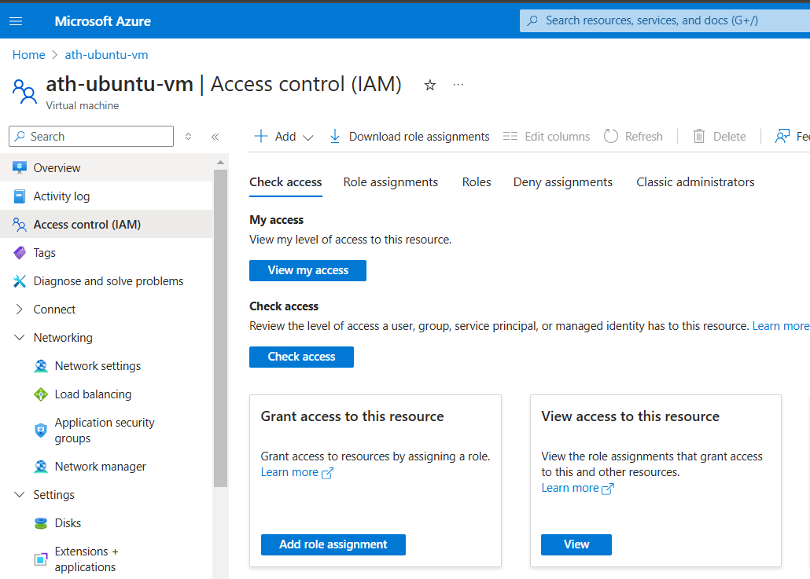

4. Click **Add > Add role assignment**.
5. Select **Reader** role.
6. Under **Assign access to**, select **User, group, or service principal**.
7. In **Select Members**, enter the additional user’s username `iam-software-lab-demo`.

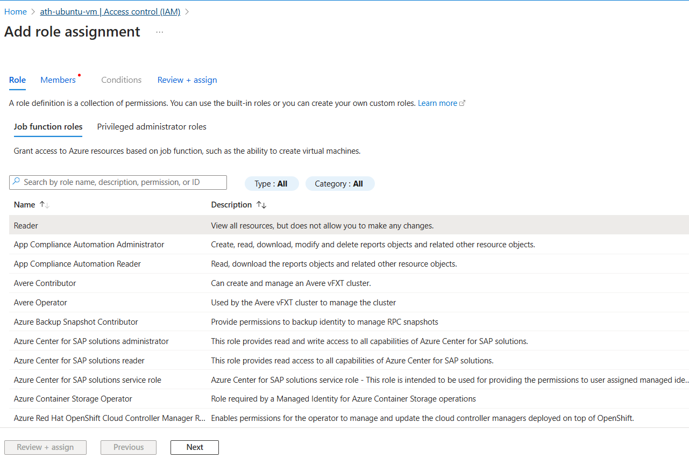

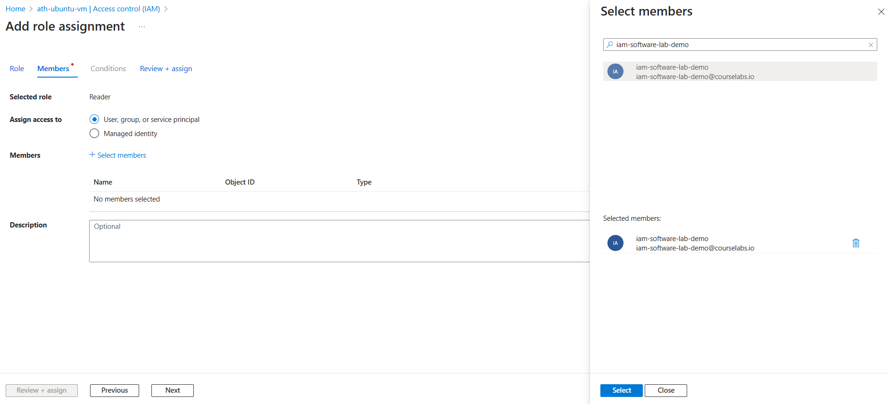

8. Click **Review + Assign**.

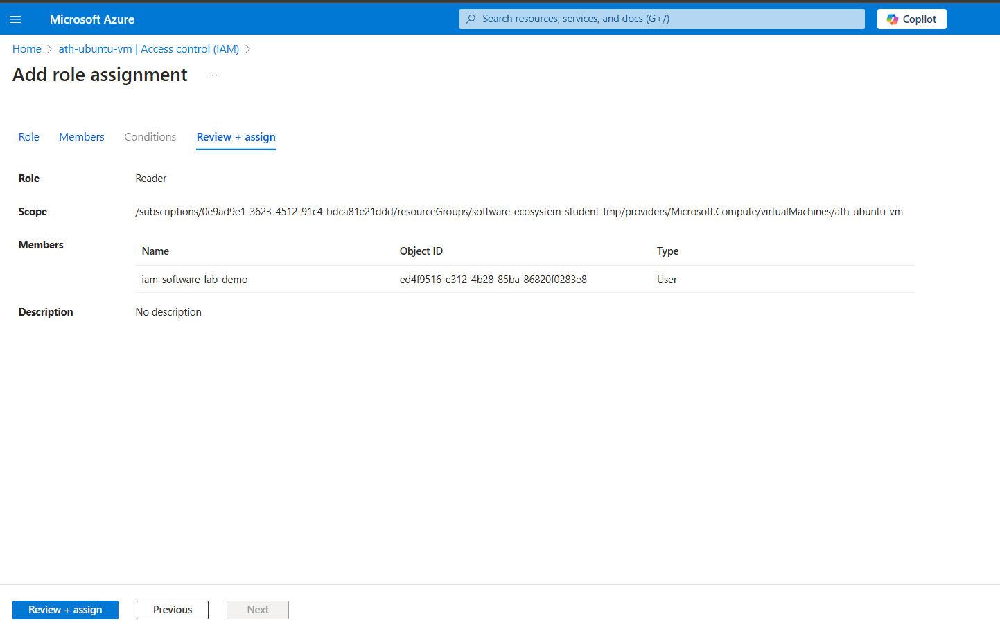

**Verification:**

1. Click on your VM and go to **Access Control (IAM)**.
2. Click **View** button in View access to this resource.

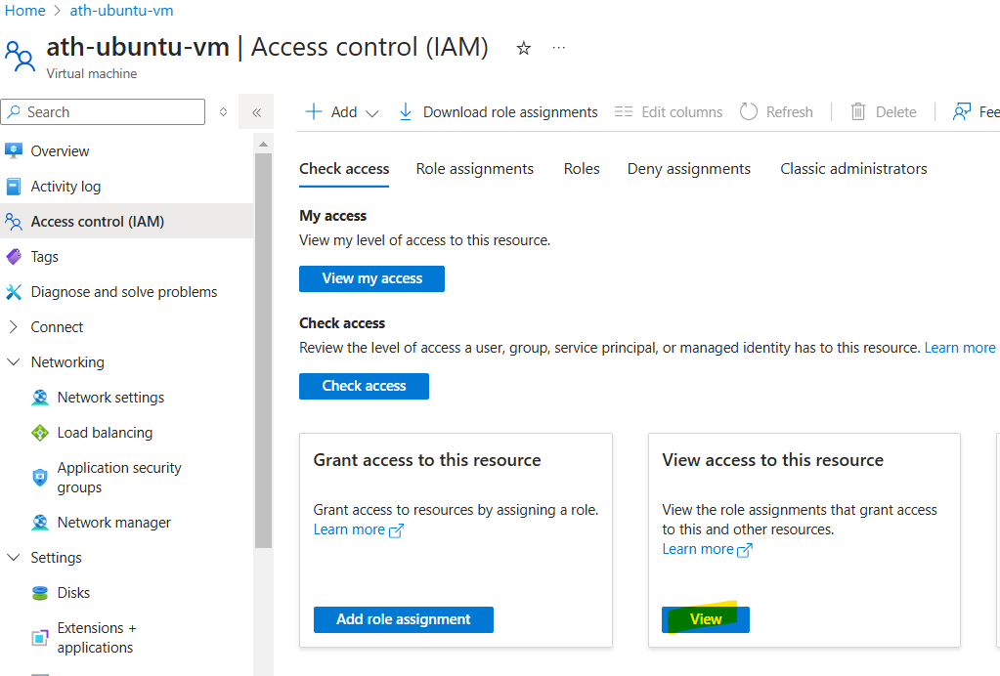

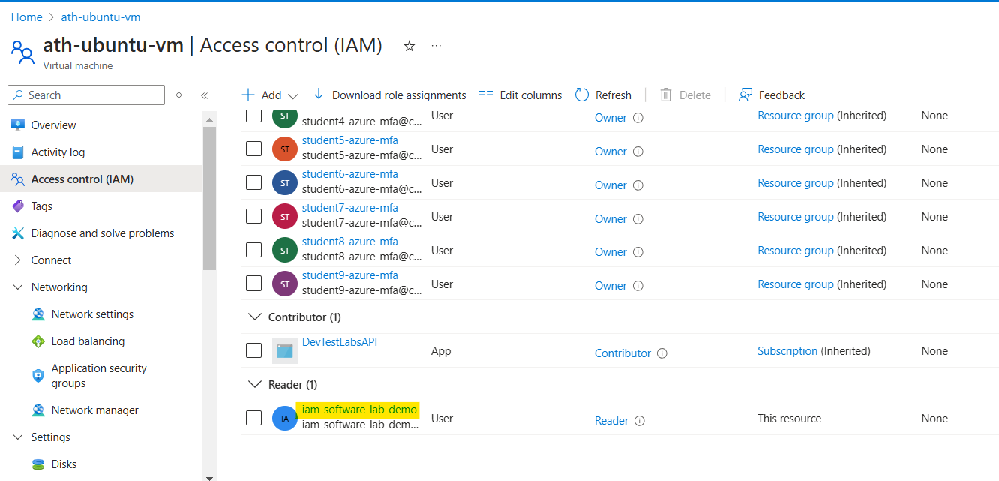

**Note:** This user can only view the VM but doesn't have permissions to **start/stop the VM**.

---

## **Step 2: Upgrade User Role to "Virtual Machine Contributor"**

1. Log back in as the original user (owner of the VM).
2. Navigate to **Virtual Machines** > **Access Control (IAM)**.
3. Click **Add role assignment**.
4. Select **Privileged administrator roles** > **Contributor**.
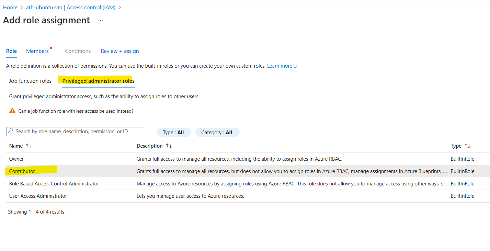

5. Assign it to the same user `iam-software-lab-demo`.
6. Click **Review + Assign**.

**Verification:**

1. Click on your VM and go to **Access Control (IAM)**.
2. Click **View** button in View access to this resource.
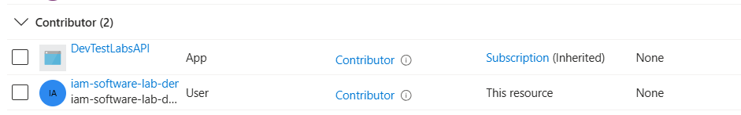

Now, this user has permissions to **start/stop the VM**.

---

## **Step 3: Configure Auto-Shutdown for Cost Optimization**

1. Navigate to **Virtual Machines** in the Azure portal.
2. Select your VM.
3. Go to **Auto-shutdown**.
4. Enable auto-shutdown and set a **shutdown time**.
5. Optionally, enter an **email** for shutdown notifications.
6. Click **Save**.

The VM will shut down at the scheduled time automatically.

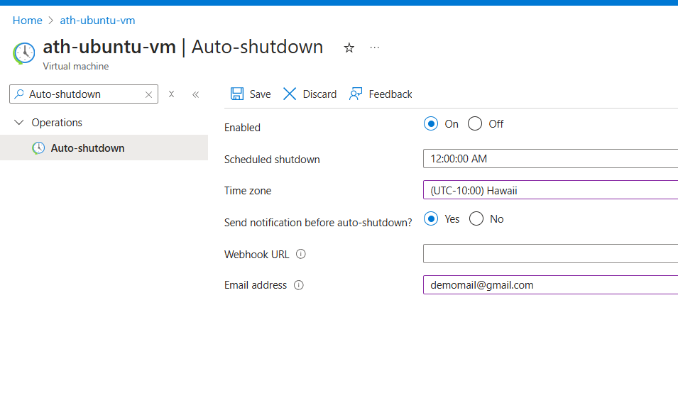

---

## **Step 4: Review Audit Logs**

1. Navigate to **Activity Log**.
2. Apply filters:
   - Event severity
   - Timespan
3. View the logs in the Azure portal.

**Verification:**
- Logs should show the actions taken, including IAM role changes.

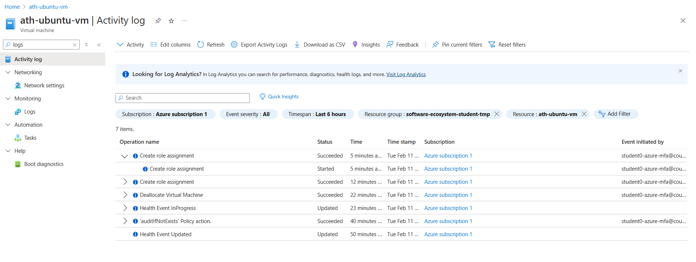

## **Step 5: Delete VM**
Make sure to delete the VM by clicking `Delete` button and selecting following options:

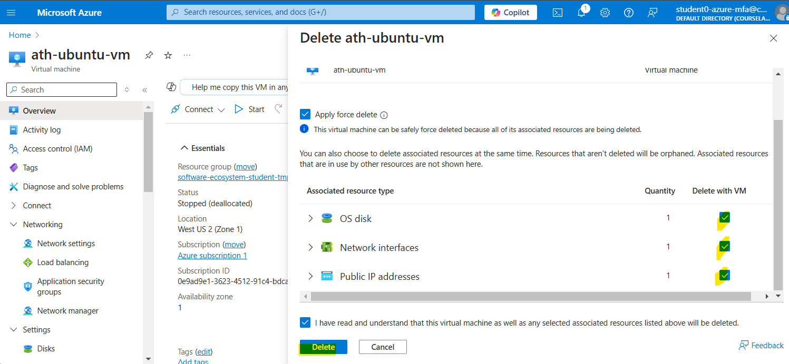

### **Conclusion**

- Assigned IAM roles using RBAC.
- Verified role-based access.
- Configured auto-shutdown for cost efficiency.
- Reviewed logs for security auditing.

