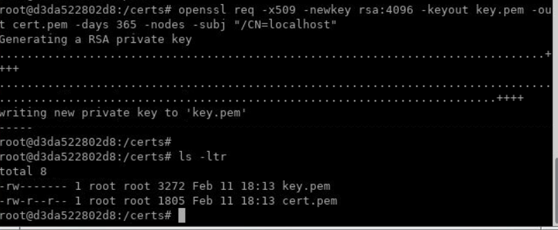
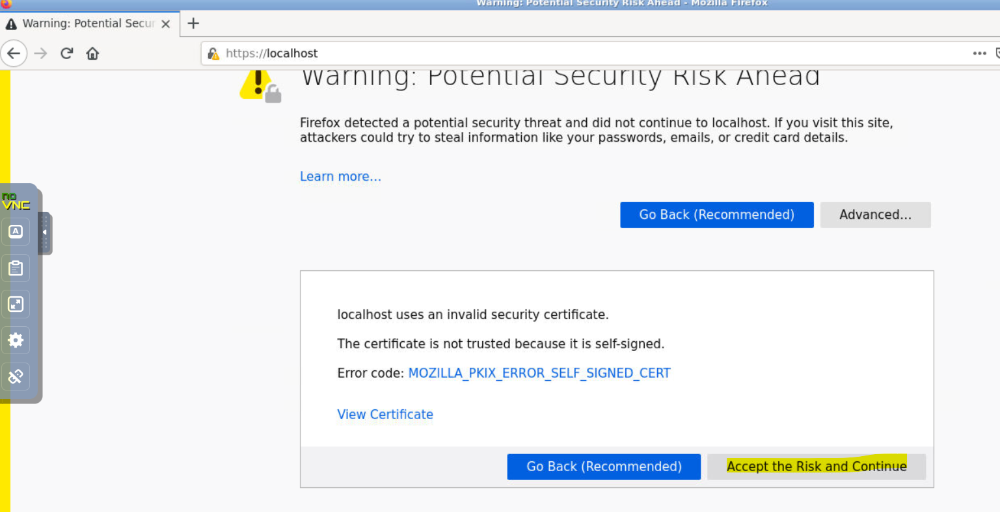
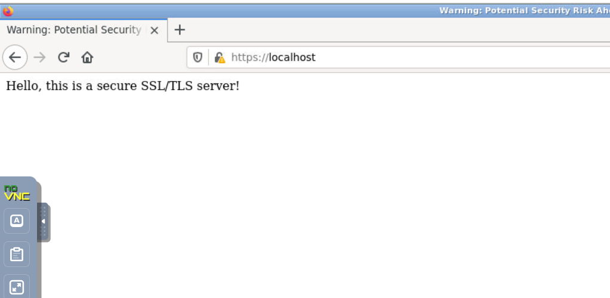
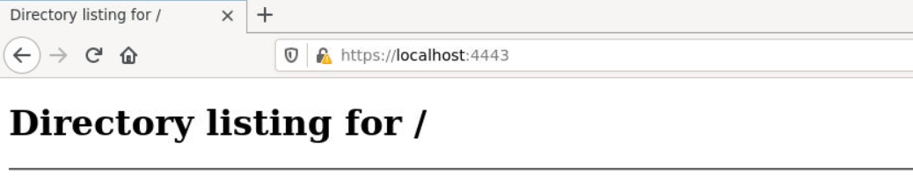
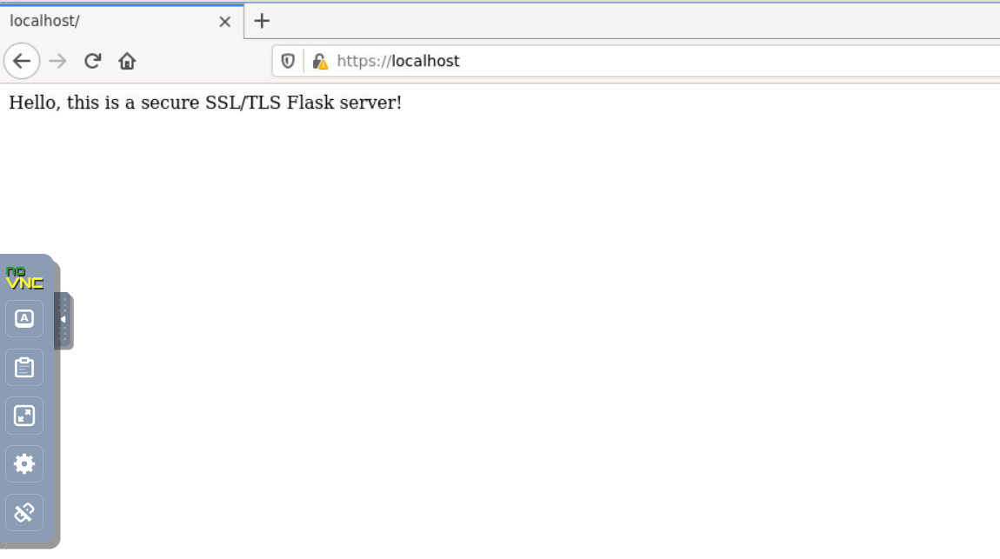

## Lab: Add SSL to a sample application for encrypted data transfer

Secure Sockets Layer (SSL) or Transport Layer Security (TLS) is crucial for encrypting data transfer between clients and servers. This guide assumes you are using Ubuntu and demonstrates how to add SSL/TLS to a Node.js or Python application using a self-signed certificate. Certificates and keys will be stored in a `/certs` directory.

---

### Step 1: Create a Directory and Generate SSL Certificates

1. **Create a `/certs` directory** (to store certificates and keys):
   ```bash
   mkdir /certs
   ```
2. **Generate a Self-Signed Certificate**:
   ```bash
   cd /certs

   openssl req -x509 -newkey rsa:4096 -keyout key.pem -out cert.pem -days 365 -nodes -subj "/CN=localhost"
   ```
   - This will produce a private key (`key.pem`) and a certificate (`cert.pem`).




---
### Step 2: SSL Setup in Node.js

Below is a simple example using the built-in `https` module.

1. **Create a Node.js Project**:
   ```bash
   cd ~/Desktop
   mkdir ssl-node-app
   cd ssl-node-app
   npm init -y
   ```

2. **Install Dependencies** (if needed for your particular framework, e.g., Express):
   ```bash
   npm install express
   ```

3. **Create a Server with HTTPS**:
   ```js
   // server.js
   const https = require('https');
   const fs = require('fs');
   const express = require('express');
   
   const app = express();

   // Load your SSL certificate and private key
   const options = {
     key: fs.readFileSync('/certs/key.pem'),
     cert: fs.readFileSync('/certs/cert.pem')
   };

   // Simple GET route
   app.get('/', (req, res) => {
     res.send('Hello, this is a secure SSL/TLS server!');
   });

   // Create HTTPS server
   https.createServer(options, app).listen(443, () => {
     console.log('HTTPS Server listening on port 443');
   });
   ```

4. **Run the Server**:
   ```bash
   node server.js
   ```
5. **Test**:
   - Open `https://localhost/` in `Firefox` browser installed inside lab environment.
   - You may see a warning for the self-signed certificate.





**Note:** Make sure to exit server before proceeding to next steps.


---
### Step 3: SSL Setup in Python

Here is an example using Python’s built-in `ssl` library with a simple HTTP server, followed by a Flask application example.

### Option A: Built-in HTTP Server

1. **Create a Simple HTTPS Server**:
   ```python
   import http.server
   import ssl

   server_address = ('localhost', 4443)
   httpd = http.server.HTTPServer(server_address, http.server.SimpleHTTPRequestHandler)

   # Wrap the socket with SSL
   httpd.socket = ssl.wrap_socket(
       httpd.socket,
       keyfile='/certs/key.pem',
       certfile='/certs/cert.pem',
       server_side=True
   )

   print('Serving on https://localhost:4443')
   httpd.serve_forever()
   ```

2. **Run the Server**:
   ```bash
   python server.py
   ```
3. **Test**:
   - Visit `https://localhost:4443/` in `Firefox` browser.
   - Accept any self-signed certificate warnings.



**Note:** Make sure to exit server before proceeding to next steps.


### Option B: Flask Application with SSL

1. Install Flask:
```bash
cd ~/Desktop

mkdir ssl-python && cd ssl-python
```
2. Create a virtual environment:
```bash
   python3 -m venv venv
```
3. Activate the virtual environment in Linux and install flask:
```bash
source venv/bin/activate

pip install flask
```

2. **Create a Flask App with SSL**:
   ```python
   from flask import Flask
   import ssl

   app = Flask(__name__)

   @app.route('/')
   def hello():
       return 'Hello, this is a secure SSL/TLS Flask server!'

   if __name__ == '__main__':
       context = ssl.SSLContext(ssl.PROTOCOL_TLS)
       context.load_cert_chain('/certs/cert.pem', '/certs/key.pem')
       app.run(host='0.0.0.0', port=443, ssl_context=context)
   ```

   **Note:** Create `app.py` file and paste above code.

3. **Run the Application**:
   ```bash
   python app.py
   ```
4. **Test**:
   - Open `https://localhost/` in `Firefox` browser.
   - You may see a security warning if using a self-signed certificate.




### Conclusion

Adding SSL/TLS to your application on Ubuntu involves creating a `/certs` directory, generating a self-signed certificate, and configuring your server to use these credentials. Follow these steps to ensure your data is encrypted and secure.

