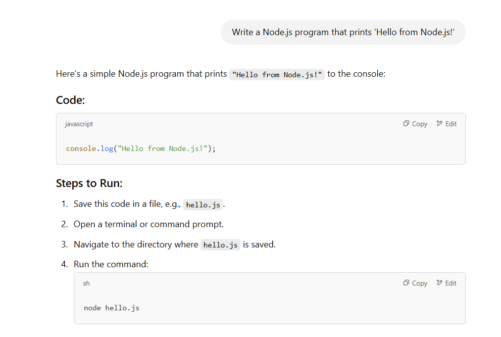
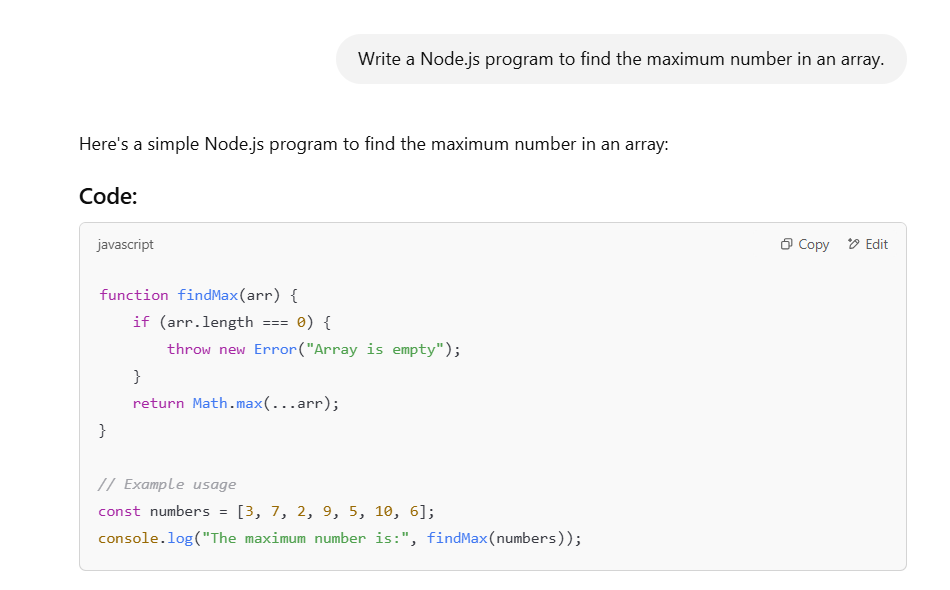

## Lab: Use AI to generate basic code snippets and analyze its suggestions

In this lab, you will learn how to utilize a AI service—like ChatGPT—to generate simple code snippets in Node.js and Python. You will then test these snippets in your own lab environment, identify any errors, and report them back to ChatGPT for further assistance.

---

### Step-by-Step Lab Instructions

### 1. Access a ChatGPT-like Tool
1. Go to [https://chatgpt.com/](https://chatgpt.com/)
2. Log in or create an account if needed.

### 2. Generate a Simple Node.js Program
1. In the AI chat, type:
   **"Write a Node.js program that prints 'Hello from Node.js!'"**

   

2. Copy the generated code snippet.
3. Create a file named `node_example.js` in your lab environment.
4. Paste the code into `node_example.js`.
5. Run it:
   ```bash
   node node_example.js
   ```
6. Observe the console output.
7. If any errors occur, copy and paste the error into ChatGPT and ask:
   **"I got the following error. How can I fix this?"**

#### Analyzing ChatGPT Suggestions
Look at the structure of the code and see if it follows standard Node.js conventions (e.g., using `console.log`, proper syntax, etc.).

---

### 3. Generate a Python Program
1. In the AI chat, request:
   **"Write a Python program that prints 'Hello from Python!'"**
2. Copy the generated code snippet.
3. Create a file named `python_example.py`.
4. Paste the code into `python_example.py`.
5. Run it:
   ```bash
   python python_example.py
   ```
6. Observe the output.
7. If any errors occur, copy and paste the error into ChatGPT and ask:
   **"Why am I getting this error and how can I fix it?"**

#### Analyzing ChatGPT Suggestions
Observe how ChatGPT structures the Python code, such as using `print()` statements, variable declarations, or function definitions.


---

### 4. Use AI to Solve Simple Coding Tasks

Try generating solutions to the following tasks in **both Node.js and Python**. Simply ask ChatGPT for a solution, then copy, paste, and run the code:

1. **Finding the Maximum Number**
   - Prompt: **"Write a Node.js program to find the maximum number in an array."**
   - Prompt: **"Write a Python program to find the maximum number in a list."**
   
   **Sample Node.js Code**:
   ```js
   function findMax(arr) {
     if (arr.length === 0) return null;
     return Math.max(...arr);
   }

   const nums = [10, 3, 25, 7];
   console.log("Max number:", findMax(nums));
   ```

   

   **Sample Python Code**:
   ```python
   def find_max(lst):
       if not lst:
           return None
       return max(lst)

   numbers = [10, 3, 25, 7]
   print("Max number:", find_max(numbers))
   ```

2. **Checking for a Prime Number**
   - Prompt: **"Write a Node.js program to check if a number is prime."**
   - Prompt: **"Write a Python program to check if a number is prime."**

   **Sample Node.js Code**:
   ```js
   function isPrime(num) {
     if (num <= 1) return false;
     for (let i = 2; i < num; i++) {
       if (num % i === 0) {
         return false;
       }
     }
     return true;
   }

   console.log(isPrime(5)); // Expected output: true
   console.log(isPrime(8)); // Expected output: false
   ```

   **Sample Python Code**:
   ```python
   def is_prime(num):
       if num <= 1:
           return False
       for i in range(2, num):
           if num % i == 0:
               return False
       return True

   print(is_prime(5))  # Expected output: True
   print(is_prime(8))  # Expected output: False
   ```

3. **Reversing a String**
   - Prompt: **"Write a Node.js program to reverse a given string."**
   - Prompt: **"Write a Python program to reverse a given string."**

   **Sample Node.js Code**:
   ```js
   function reverseString(str) {
     return str.split('').reverse().join('');
   }

   console.log(reverseString("Hello World")); // Expected output: "dlroW olleH"
   ```

   **Sample Python Code**:
   ```python
   def reverse_string(s):
       return s[::-1]

   print(reverse_string("Hello World"))  # Expected output: "dlroW olleH"
   ```

After running each program:
- Confirm the output is correct.
- Report any errors or unexpected results back to ChatGPT.
- Ask ChatGPT for explanations or revisions if the code doesn't work as intended.

---

### 5. Analyze ChatGPT’s Suggestions

- **Compare Approaches**: Notice how ChatGPT may solve the same problem in different ways on multiple requests. Compare and contrast the solutions to understand trade-offs.
- **Check for Efficiency**: Ask ChatGPT if there is a more efficient solution (e.g., shorter runtime, less memory usage).
- **Request Clarification**: If ChatGPT references unfamiliar concepts, ask for a short explanation or a breakdown.

