## Lab: Create a simple AI-integrated workflow for generating code comments or debugging

This lab guide will walk you through creating a simple AI workflow using Langflow to generate helpful code comments or debug suggestions. Langflow is a tool that helps you build, visualize, and automate pipelines for Large Language Model (LLM) tasks.


### Lab Objective

By the end of this lab, you will:

1. Understand how to create a new workflow in Langflow.
2. Integrate an AI LLM node to receive code snippets and produce code comments or debugging tips.
3. Test and refine the prompt and flow for real-time debugging or code commenting use.


### **Part 1: Account Setup and Getting Started**

### **Step 1: Access LangFlow**
1. Open your web browser and navigate to [LangFlow](https://www.langflow.org/).
2. Click on the **Sign Up** button in the top-right corner of the homepage.

### **Step 2: Create an Account**
1. Fill in the required details or Signup using other options.
2. Click the **Sign Up** button.

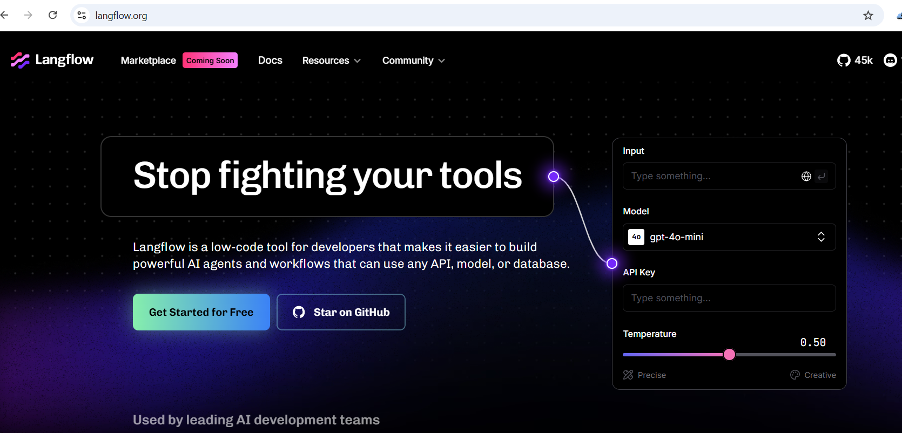

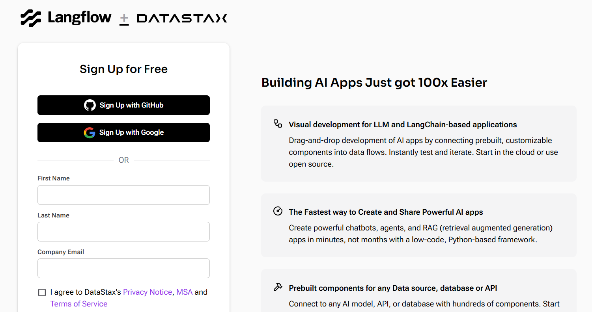


### **Step 3: Verify Your Email (If Required)**
1. Check your inbox for a verification email from LangFlow.
2. Click on the verification link to activate your account.


## **Use Case : Coding Assistant**

## Step 1: Log In
1. Return to [LangFlow](https://www.langflow.org/) and **Log In**.

## Step 2: Create a New Flow
1. Log in to LangFlow.
2. On the dashboard, click **New Flow**.
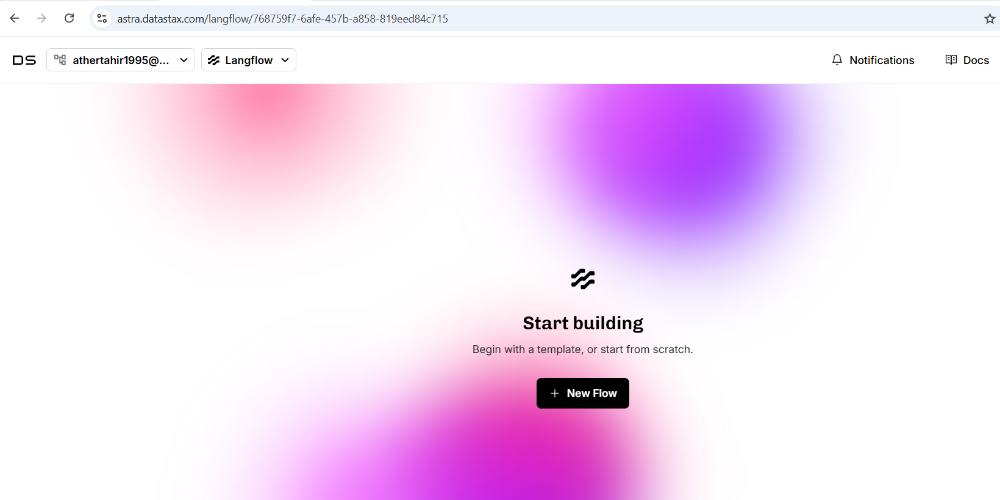

3. Now, click **Blank Flow**.
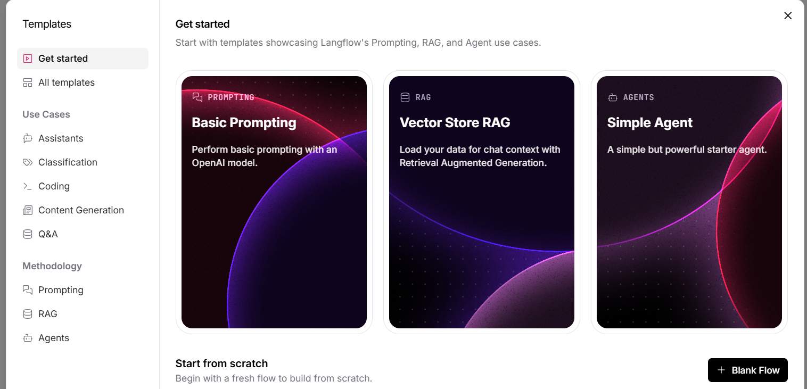

---

## Step 3: Add a Chat Input Node

Drag a **Chat Input** node from the **Inputs** section to the canvas.

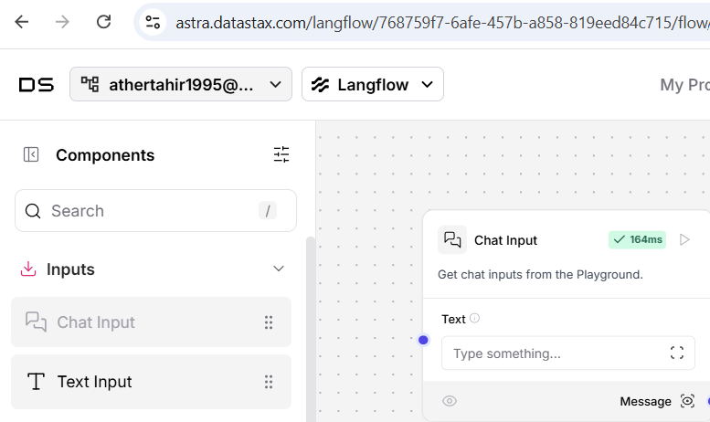

## Step 4: Add OpenAI Node

1. On the left panel, search for the **OpenAI**.
2. Drag an **OpenAI**  node onto the canvas.
3. In the node's settings, configure the following:
   - **Model**: keep the default model or you can choose a different model.
   - **API Key**: Provide your API key.
   - **Temperature**: Set an appropriate value (e.g., 0.3) to keep the responses somewhat focused.
4. Link **Chat Input** with **Input**:

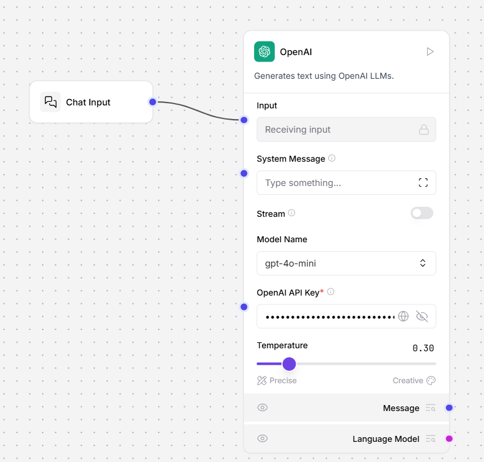

---

## Step 5: Add a Prompt Template Node

1. Find the **Prompt Template** node in the **Prompts** section.
2. Drag the **Prompt Template** node onto the canvas.
3. In this node's settings:
   - **Prompt**: Provide a template that indicates the desired output. For instance:

     ```
     You are an AI code reviewer. Below is a code snippet:
     {code_snippet}

     Task:
     1. Generate meaningful comments that explain the functionality.
     2. Identify potential bugs or logical errors and provide debugging suggestions.

     Output Format:
     - Comments: <Your code comments>
     - Debug Suggestions: <Your debugging tips>
     ```
   - **Input Variables**: Set the variable name to `code_snippet` so it can dynamically receive code.

   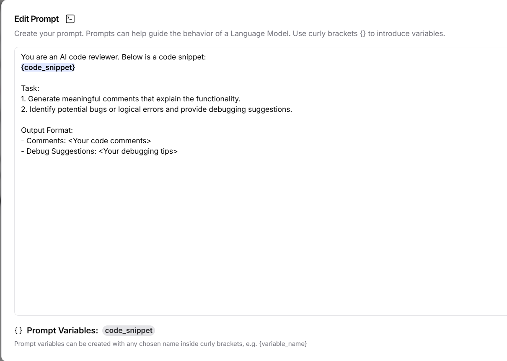


   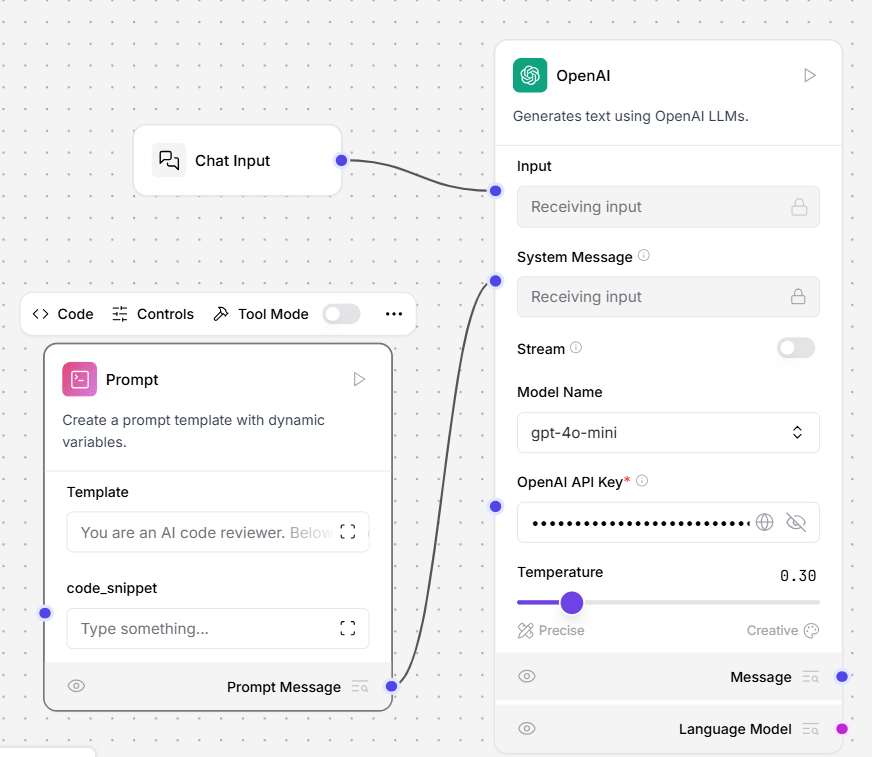


---

## Step 6: Connect Nodes

1. Make sure to connect the **Prompt** node's output to the **OpenAI** node's input.
2. This ensures that the final prompt from the template will be processed by the model.


This setup will let you paste code directly into Langflow for analysis.

---

## Step 7: Add an Output Display Node

1. Drag an **Chat Output** node from the **Outputs** section.
2. Connect the **OpenAI** node to this output node.
3. This node will display the AI-generated comments and debug suggestions in an easy-to-read format.

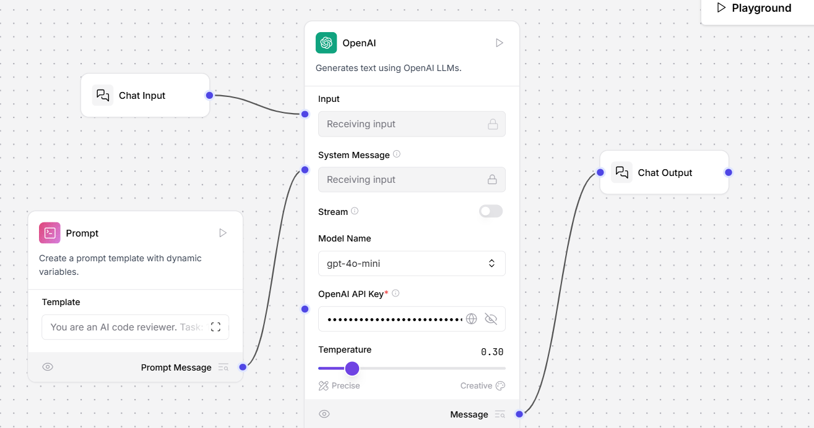


---

## Step 8: Run the Flow

1. Once everything is connected, press **Playground** button in Langflow:
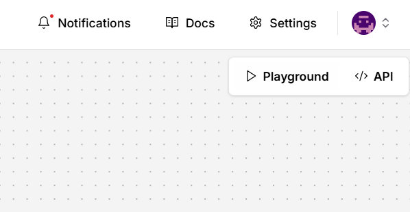

2. In the text input field for code snippet, paste some sample code. For example:
   ```python
   def add_numbers(a, b):
       c = a + b
       return c
   ```
3. The output node should display the AI-generated comments and debug suggestions.
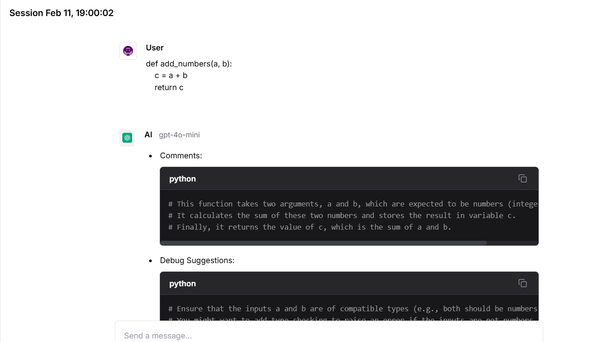

---

## Step 9: Refine the Prompt and Settings

1. Adjust the temperature in the LLM node if the suggestions are too varied or not varied enough.
2. Modify the prompt template to change the output format or add more detail.
3. If you find the AI incorrectly identifies bugs or provides irrelevant comments, add clarifying instructions to the prompt.


### Task
Enter different code snippets from the previous labs and analyze the output.


---------------------------------------------------

### Bonus Tasks

### **Use Case 1: Health Care Staffing Invoice Generator**

### **Objective**:
Create a flow to:
- Generate invoices for clients.
- Calculate recruiter commissions.
- Summarize placement data.

### **Steps**

#### **Step 1: Create a New Flow**
1. Log in to LangFlow.
2. On the dashboard, click **New Flow**.


3. Now, click **Blank Flow**.


#### **Step 2: Add an Input Node**
1. Drag and drop the **Input** node onto the canvas.
2. Select **Chat Input**.


#### **Step 3: Add a Calculation Node**
1. Drag the **Calculation** node to the canvas.
2. Enter Expression: `Recruiter commission (e.g., 10% of placement cost)`.

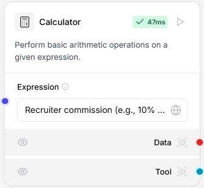

#### **Step 4: Add an Agent Node**
1. Drag the **Agent** node onto the canvas.
2. Connect it to the Calculation node and Input node as show below.
3. Enter `OpenAI` key.

#### **Step 5: Add an Output Node**
1. Drag the **Chat Output** node onto the canvas.
2. Connect it to the `Response` part of `Agent` node.

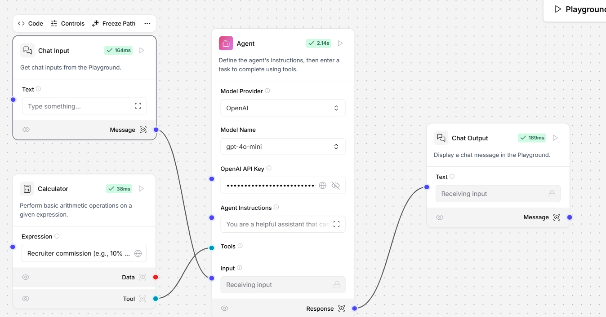

#### **Step 6: Test the Flow**

1. Click Playground button:


2. Enter sample data in the playground:
   ```
   Client: ABC Hospital
   Staff placed: 5
   Placement cost: $20,000

   Give me Recruiter commission (e.g., 10% of placement cost)
   ```

3. Run the flow and review the generated invoice.

   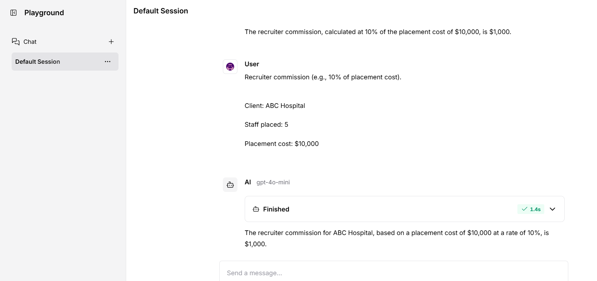


2. Enter new data in the playground to generate invoice:
   ```
   Client: XYZ Hospital

   Nurses: 12
   Doctors : 5
   Radiologist: 3

   Placement cost: $130,000


   Generate an text invoice for above hospital staffing quotes in details. Add 25% misc charges and 1340$ Tax
   ```


3. Run the flow and review the generated invoice.

   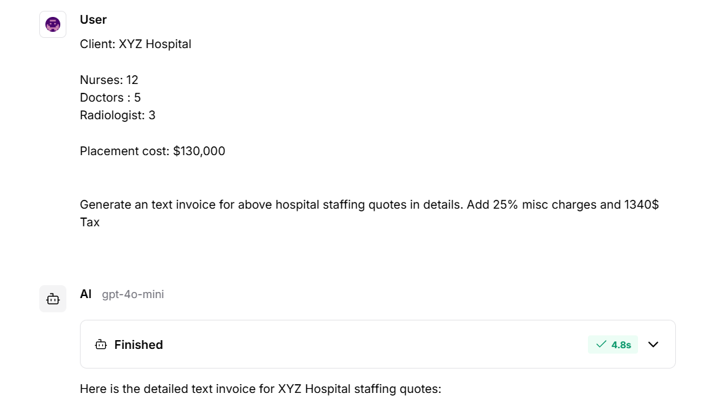

   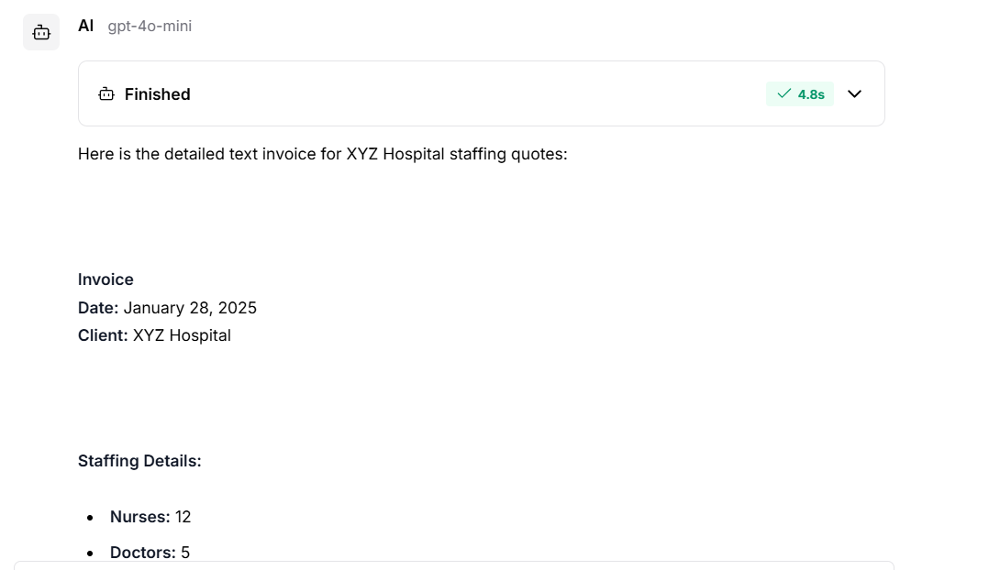

   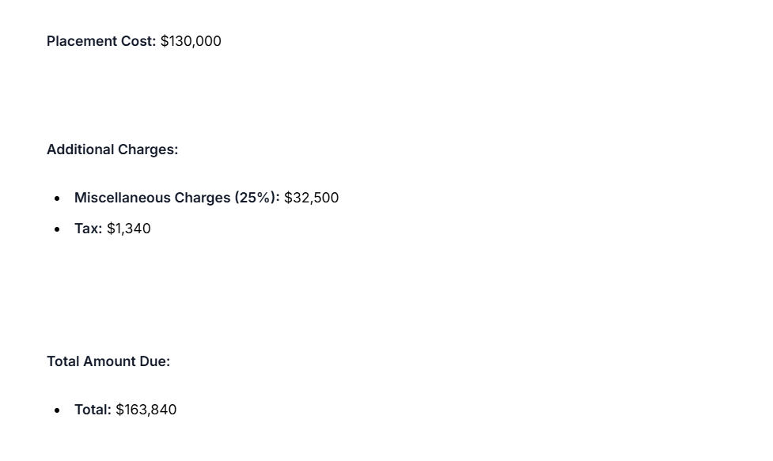


### Task: Explore the Flow

Explore the flow by giving different prompts and bigger calculations.


# **Task: Canadian Federal Government Document Summarizer**

### **Objective**:
Create a flow to:
- Summarize and analyze large government documents.

### **Steps**

#### **Step 1: Create a New Flow**
1. Log in to LangFlow.
2. Click **New Flow** on the dashboard.


#### **Step 2: Add File Node**
1. Drag and drop the **File** node onto the canvas.
2. Configure it to upload:
   - Government policy document `canada_visa_requirements.pdf` from the GitHub repo.

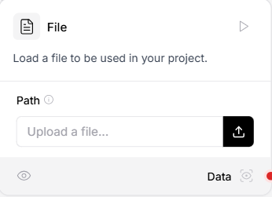

#### **Step 3: Add Parse Data Node**
1. Drag and drop the **Parse Data** node onto the canvas.
2. Set **Template** to `{text}`.

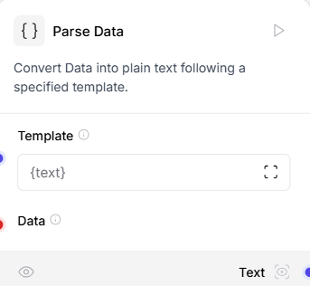

#### **Step 4: Add Chat Input Node**
1. Drag and drop the **Chat Input** node onto the canvas.
2. Set **Text** to `What is this document is about?`.

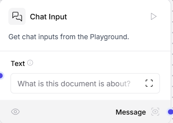

#### **Step 5: Add Prompt Node**
1. Drag and drop the **Prompt** node onto the canvas.
2. Set **Template** to the following:
   ```
   Answer user's questions based on the document below:

   ---

   {Document}

   ---

   Question:
   ```


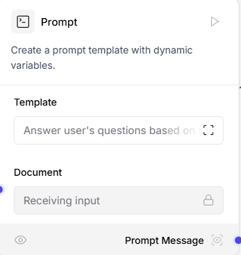

#### **Step 6: Add OpenAI Node**
1. Drag the **OpenAI** node onto the canvas.
2. Enter `OpenAI API Key` key.

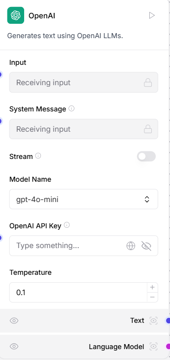


#### **Step 7: Add Chat Output Node**
1. Drag and drop the **Chat Output** node onto the canvas.

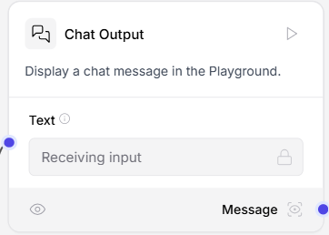

#### **Step 8: Connect all nodes as shown below:**

Connect all the nodes as shown below:
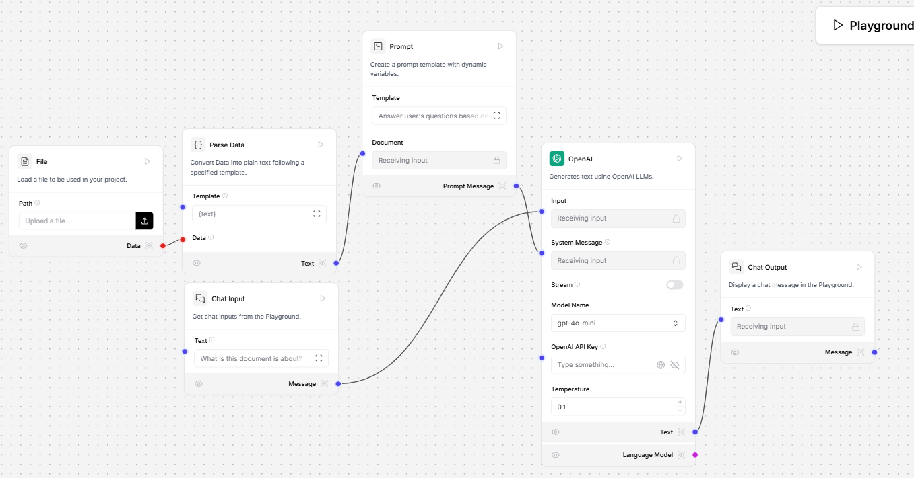


#### **Step 8: Test the Flow**

1. Upload file `canada_visa_requirements.pdf` and click **Run** icon:

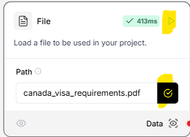

2. Click Playground button:


3. Enter sample data in the playground:
   - What is this document is about?
   - Do people from United States need to apply for Visa?
   - Do people from SouthAfrica need to apply for Visa?
   - What is the requirement for Workers and students visa?

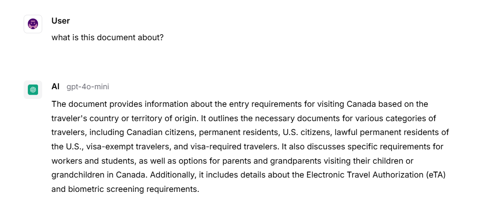

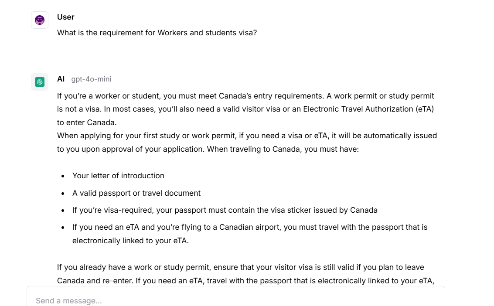

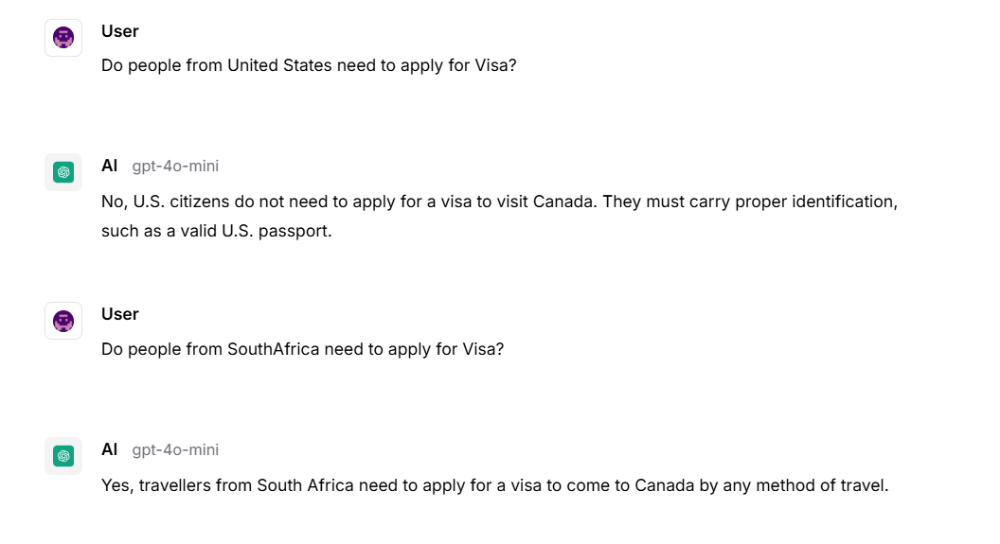
