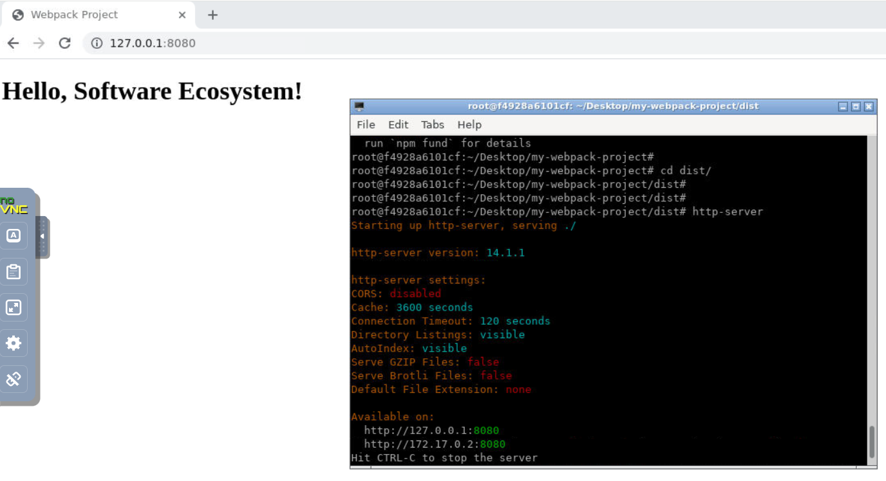

# Lab: Setting Up a Simple Project with npm and Webpack

This guide will walk you through setting up a simple project using npm, installing dependencies, and creating a Webpack build script.

---

## Prerequisites

Ensure you have the following installed on your system:

- [Node.js 18](https://nodejs.org/) (which includes npm)
- A text editor (e.g., VS Code)

---

Open new terminal in the lab environment:


### Steps

### Step 1: Initialize a New npm Project

1. Create a new project directory:
   ```bash
   cd ~/Desktop
   mkdir my-webpack-project
   cd my-webpack-project
   ```

2. Initialize the project:
   ```bash
   npm init -y
   ```
   This will create a `package.json` file with default values.


---

### Step 2: Install Webpack and Dependencies

1. Install Webpack and Webpack CLI as development dependencies:
   ```bash
   npm install webpack webpack-cli --save-dev
   ```

2. Optionally, install a development server for live reloading:
   ```bash
   npm install webpack-dev-server --save-dev
   ```

3. Install Babel to transpile modern JavaScript (optional but recommended):
   ```bash
   npm install @babel/core babel-loader @babel/preset-env --save-dev
   ```

4. Install HTML Webpack Plugin to handle HTML files:
   ```bash
   npm install html-webpack-plugin --save-dev
   ```

---

### Step 3: Create the Project Structure

**Note:** You can open project in VsCode as shown below:


Create the following file structure:

```
my-webpack-project/
|-- src/
|   |-- index.js
|   |-- index.html
|-- dist/
|-- .babelrc
|-- webpack.config.js
|-- package.json
```

1. Create a `src` folder and add an `index.js` file:
   ```bash
   mkdir src
   touch src/index.js
   ```
   Add some basic JavaScript to `src/index.js`:
   ```javascript
   document.addEventListener('DOMContentLoaded', () => {
     const app = document.getElementById('app');
     app.innerHTML = '<h1>Hello, Software Ecosystem!</h1>';
   });
   ```

2. Create an empty `dist` folder:
   ```bash
   mkdir dist
   ```

3. Create a `.babelrc` file for Babel configuration:
   ```bash
   touch .babelrc
   ```
   Add the following content to `.babelrc`:
   ```json
   {
     "presets": ["@babel/preset-env"]
   }
   ```

4. Create a `webpack.config.js` file:
   ```bash
   touch webpack.config.js
   ```
   Add the following content to `webpack.config.js`:
   ```javascript
   import path from 'path';
   import HtmlWebpackPlugin from 'html-webpack-plugin';

   export default {
   entry: './src/index.js',
   output: {
      filename: 'bundle.js',
      path: path.resolve(process.cwd(), 'dist'),
   },
   module: {
      rules: [
         {
         test: /\.js$/,
         exclude: /node_modules/,
         use: {
            loader: 'babel-loader',
         },
         },
      ],
   },
   plugins: [
      new HtmlWebpackPlugin({
         template: './src/index.html',
      }),
   ],
   devServer: {
      static: './dist',
      open: true,
   },
   mode: 'development',
   };
   ```

5. Create an `index.html` file inside `src`:
   ```bash
   touch src/index.html
   ```
   Add the following content to `src/index.html`:
   ```html
   <!DOCTYPE html>
   <html>
     <head>
       <title>Webpack Project</title>
     </head>
     <body>
       <div id="app"></div>
       <script src="bundle.js"></script>
     </body>
   </html>
   ```

---

### Step 4: Add npm Scripts

1. Open `package.json` and add the following scripts:
   ```json
   "scripts": {
     "start": "webpack-dev-server --open",
     "build": "webpack"
   }
   ```

   - `start`: Runs the development server.
   - `build`: Builds the project for production.

2. Configure Node.js to treat your project as an ES Module:

Update `package.json` to include:

```
"type": "module"
```


---

### Step 5: Run and Build the Project

1. Start the development server:
   ```bash
   npm start
   ```
   


   This will open your project in the browser and watch for changes.


2. Build the project for production:
   ```bash
   npm run build
   ```
   This will create a `bundle.js` file inside the `dist` folder.


---

### Step 6: Run the Build Output in the Browser

After building your project, you can view the output in a browser by following these steps:

1. **Locate the Built Files:**
   Ensure the build output files (e.g., `bundle.js`) are in the `dist` folder after running `npm run build`.

2. **Serve the `dist` Folder:**
   Use one of the following methods to serve the `dist` folder:

   - **Using a Simple HTTP Server:**
     Install a simple server globally:
     ```bash
     npm install -g http-server
     ```
     Navigate to the `dist` folder and start the server:
     ```bash
     cd dist
     http-server
     ```
     This will provide a URL (e.g., `http://localhost:8080`) to open in your browser.

   - **Direct File Opening:**
     Open the `index.html` file in the `dist` folder directly in a browser. Note that this method might not work correctly if your app uses dynamic imports or other features requiring a web server.




**Important!** Make sure to stop any running server from the lab terminal before proceeding to next lab.

You have successfully set up a nodejs project using npm and Webpack!
