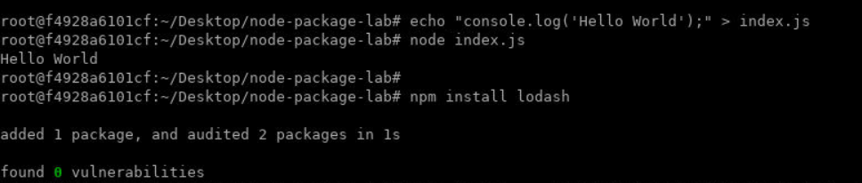
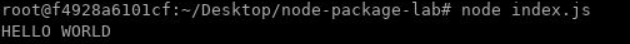
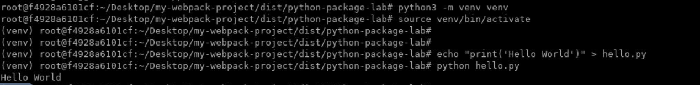
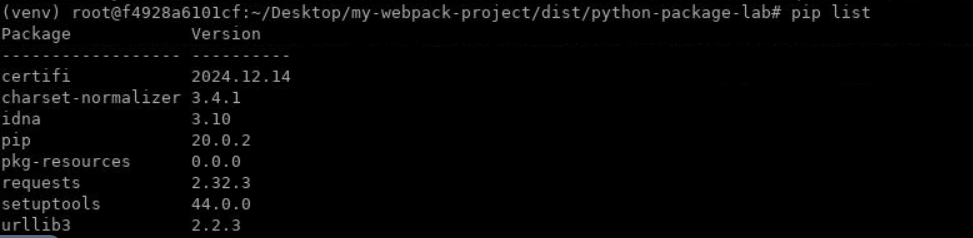
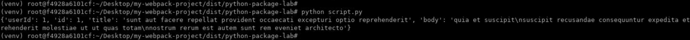

# Lab: Practice Basic Package Management Commands to Add, Update, and Remove Dependencies

## Lab Overview
In this lab, you will practice adding, updating, and removing dependencies using package management tools in both Node.js (npm) and Python (pip).

---

## Prerequisites
1. Node.js installed
   - Verify with `node -v` and `npm -v`
2. Python 3.8 installed
   - Verify with `python3 --version` or `python --version`
3. A text editor or IDE (e.g., VS Code)
4. Command-line/terminal access

---

## Part 1: Node.js Package Management with npm

### Step 1: Initialize a Node.js Project
1. Open your terminal and create a new directory:
   ```bash
   cd ~/Desktop
   mkdir node-package-lab
   cd node-package-lab
   ```
2. Initialize a new Node.js project:
   ```bash
   npm init -y
   ```
   - This creates a `package.json` file.
3. Print "Hello World":
   ```bash
   echo "console.log('Hello World');" > index.js
   node index.js
   ```

### Step 2: Add Dependencies
1. Add a dependency (e.g., `lodash`):
   ```bash
   npm install lodash
   ```

   

2. Verify that `lodash` was added to your `package.json` under `dependencies`.
3. Check the `node_modules` folder to confirm installation.

### Step 3: Use and Run Installed Package
1. Modify `index.js` to use `lodash`:
   ```
   const _ = require('lodash');
   console.log(_.toUpper('hello world'));
   ```

   Run the foolllowing command from the terminal:
   ```bash
   node index.js
   ```

   

   - This code uses `lodash` to toUpper the string "hello world".

### Step 4: Update Dependencies
1. Update the `lodash` package to the latest version:
   ```bash
   npm update lodash
   ```
2. Verify the updated version in `package.json` and `package-lock.json`.

### Step 5: Remove Dependencies
1. Remove the `lodash` package:
   ```bash
   npm uninstall lodash
   ```
2. Verify that `lodash` has been removed from `package.json` and the `node_modules` folder.

---

## Part 2: Python Package Management with pip

### Step 1: Set Up a Python Virtual Environment
1. Create a new directory:
   ```bash
   cd ~/Desktop
   mkdir python-package-lab
   cd python-package-lab
   ```
2. Create a virtual environment:
   ```bash
   python3 -m venv venv
   ```
3. Activate the virtual environment in Linux:
   ```bash
   source venv/bin/activate
   ```

4. Print "Hello World":
   ```bash
   echo "print('Hello World')" > hello.py
   python hello.py
   ```

   

### Step 2: Add Dependencies
1. Install a package (e.g., `requests`):
   ```bash
   pip install requests
   ```
2. Verify installation:
   ```bash
   pip list
   ```

   

3. Freeze dependencies to a `requirements.txt` file:
   ```bash
   pip freeze > requirements.txt
   ```

### Step 3: Use and Run Installed Package
1. Create a `script.py` file to use `requests`:

   ```
   import requests

   # Sending a GET request to the API endpoint
   response = requests.get('https://jsonplaceholder.typicode.com/posts/1')

   # Checking if the request was successful
   if response.status_code == 200:
      # Printing the JSON response as a dictionary
      print(response.json())
   else:
      # Printing an error message if the request failed
      print(f"Request failed with status code: {response.status_code}")
   ```

2. Run the script with following command:
   ```bash
   python script.py
   ```

   - This code fetches and prints a sample JSON response from a placeholder API.

   

### Step 4: Update Dependencies
1. Upgrade the `requests` package:
   ```bash
   pip install --upgrade requests
   ```
2. Verify the updated version:
   ```bash
   pip list
   ```

### Step 5: Remove Dependencies
1. Uninstall the `requests` package:
   ```bash
   pip uninstall requests
   ```
2. Verify removal:
   ```bash
   pip list
   ```

### Step 6: Deactivate Virtual Environment
1. Deactivate the virtual environment:
   ```bash
   deactivate
   ```

---

## Summary
In this lab, you learned how to:
1. Add, update, and remove dependencies using npm for Node.js.
2. Add, update, and remove dependencies using pip for Python in a virtual environment.
3. Run code using installed packages in both Node.js and Python.
