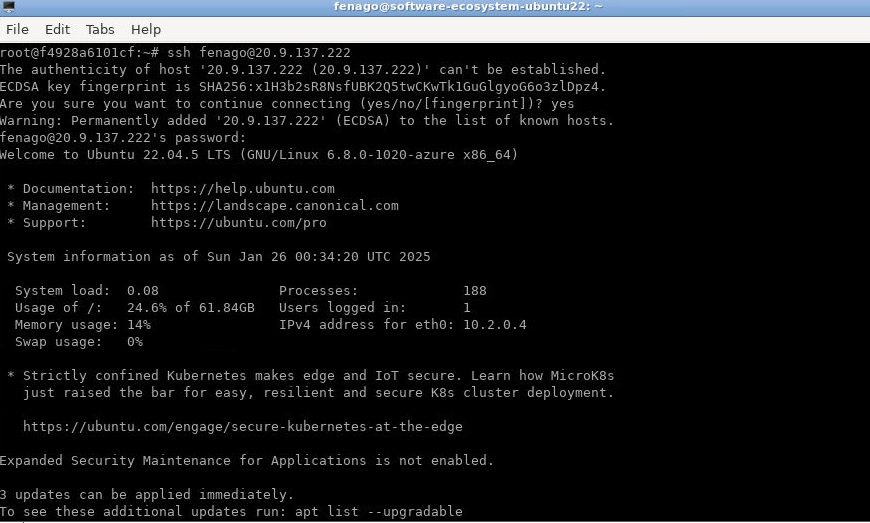
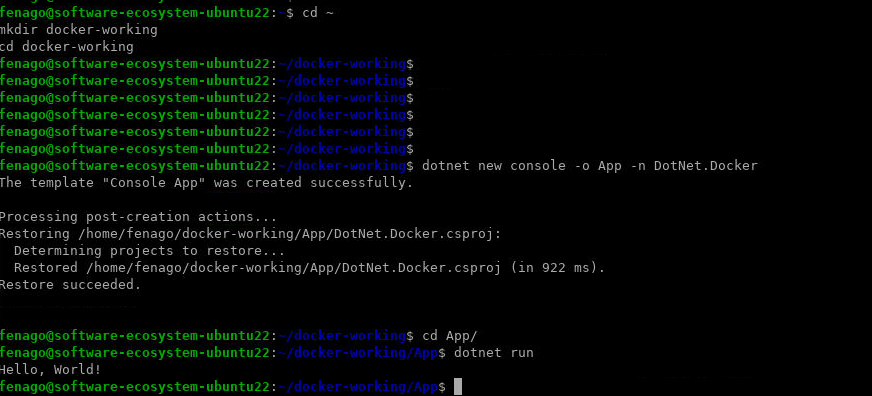
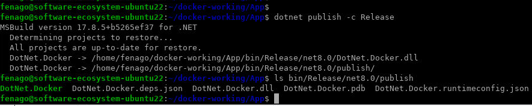
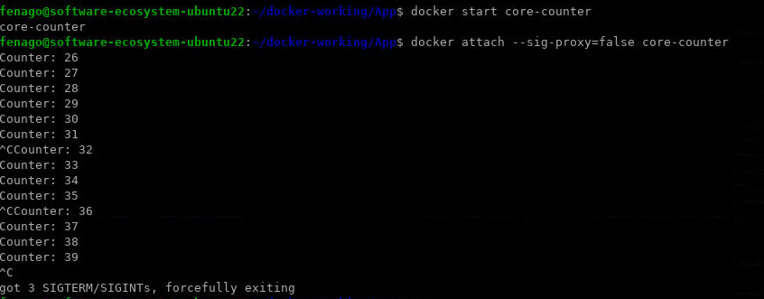
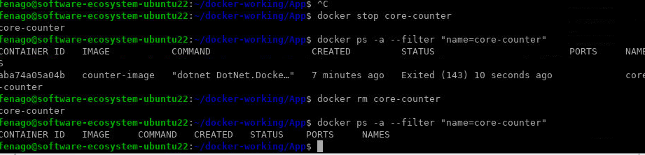
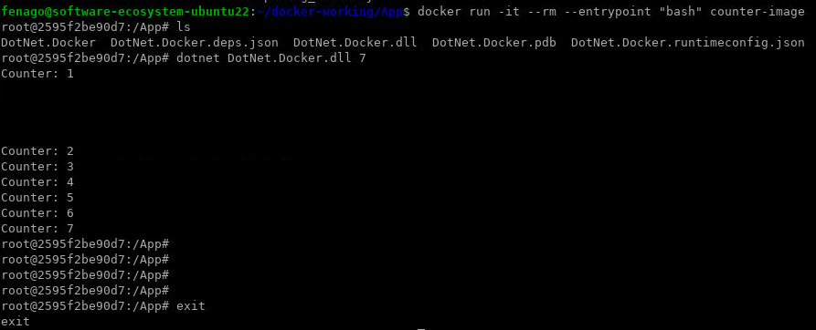
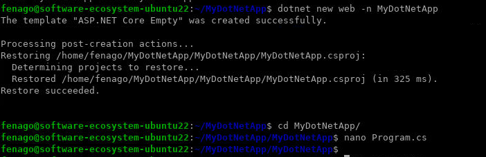
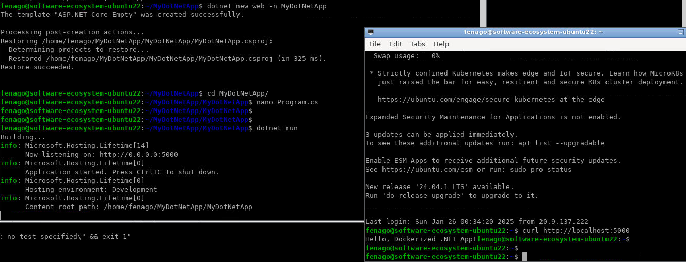

## Lab: Create a Docker container for a simple .NET Core app and run it locally

### Activity: Containerize a .NET app (Console)

In this tutorial, you learn how to containerize a .NET application with Docker. Containers have many features and benefits, such as being an immutable infrastructure, providing a portable architecture, and enabling scalability. The image can be used to create containers for your local development environment, private cloud, or public cloud.

In this tutorial, you:

> - Create and publish a simple .NET app
> - Create and configure a Dockerfile for .NET
> - Build a Docker image
> - Create and run a Docker container

You explore the Docker container build and deploy tasks for a .NET application. The _Docker platform_ uses the _Docker engine_ to quickly build and package apps as _Docker images_. These images are written in the _Dockerfile_ format to be deployed and run in a layered container.


## IMPORTANT: Open Terminal and Connect via SSH

1. Open a terminal on your local machine.
2. Use the following command to connect to the remote machine via SSH:
   ```bash
   ssh username@remote_host
   ```
   Replace `username` with your SSH username and `remote_host` with the hostname of your lab environment.
   **Note:** Instructor will provide username & password.
3. If prompted, enter your SSH password to establish the connection.



**Note:** You can connect using SSH with remote lab machine using your local machine.


## Prerequisites

- Use the `dotnet --info` command to determine which SDK you're using.

## Create .NET app

You need a .NET app that the Docker container runs. Open your terminal, create a working folder if you haven't already, and enter it. In the working folder, run the following command to create a new project in a subdirectory named _App_:

```
cd ~
mkdir docker-working
cd docker-working 
dotnet new console -o App -n DotNet.Docker
```

Your folder tree looks similar to the following directory structure:

```Directory
📁 docker-working
    └──📂 App
        ├──DotNet.Docker.csproj
        ├──Program.cs
        └──📂 obj
            ├── DotNet.Docker.csproj.nuget.dgspec.json
            ├── DotNet.Docker.csproj.nuget.g.props
            ├── DotNet.Docker.csproj.nuget.g.targets
            ├── project.assets.json
            └── project.nuget.cache
```

The `dotnet new` command creates a new folder named _App_ and generates a "Hello World" console application. Now, you change directories and navigate into the _App_ folder from your terminal session. Use the `dotnet run` command to start the app. The application runs, and prints `Hello World!` below the command:

```
cd App
dotnet run
```



The default template creates an app that prints to the terminal and then immediately terminates. For this tutorial, you use an app that loops indefinitely. Open the _Program.cs_ file in a text editor.


The _Program.cs_ should look like the following C# code:

```csharp
Console.WriteLine("Hello World!");
```

Replace the file with the following code that counts numbers every second:

```
var counter = 0;
var max = args.Length is not 0 ? Convert.ToInt32(args[0]) : -1;

while (max is -1 || counter < max)
{
    Console.WriteLine($"Counter: {++counter}");

    await Task.Delay(TimeSpan.FromMilliseconds(1_000));
}
```

Save the file and test the program again with `dotnet run`. Remember that this app runs indefinitely. Use the cancel command <kbd>Ctrl+C</kbd> to stop it. Consider the following example output:

```
dotnet run
Counter: 1
Counter: 2
Counter: 3
Counter: 4
^C
```

If you pass a number on the command line to the app, it limits the count to that amount and then exits. Try it with `dotnet run -- 5` to count to five.

**IMPORTANT:** Any parameters after `--` aren't passed to the `dotnet run` command and instead are passed to your application.

## Publish .NET app

In order for the app to be suitable for an image creation it has to compile. The `dotnet publish` command is most apt for this, as it builds and publishes the app. 

```
dotnet publish -c Release
```


The `dotnet publish` command compiles your app to the _publish_ folder. The path to the _publish_ folder from the working folder should be _./App/bin/Release/\<TFM\>/publish/_:


Use the `ls` command to get a directory listing and verify that the _DotNet.Docker.dll_ file was created.


```bash
me@DESKTOP:/docker-working/app$ ls bin/Release/net8.0/publish
DotNet.Docker.deps.json  DotNet.Docker.dll  DotNet.Docker.exe  DotNet.Docker.pdb  DotNet.Docker.runtimeconfig.json
```



## Create the Dockerfile

The _Dockerfile_ file is used by the `docker build` command to create a container image. This file is a text file named _Dockerfile_ that doesn't have an extension.

Create a file named _Dockerfile_ in the directory containing the _.csproj_ and open it in a text editor. This tutorial uses the ASP.NET Core runtime image (which contains the .NET runtime image) and corresponds with the .NET console application.

```
FROM mcr.microsoft.com/dotnet/sdk:8.0@sha256:35792ea4ad1db051981f62b313f1be3b46b1f45cadbaa3c288cd0d3056eefb83 AS build
WORKDIR /App

# Copy everything
COPY . ./
# Restore as distinct layers
RUN dotnet restore
# Build and publish a release
RUN dotnet publish -o out

# Build runtime image
FROM mcr.microsoft.com/dotnet/aspnet:8.0@sha256:6c4df091e4e531bb93bdbfe7e7f0998e7ced344f54426b7e874116a3dc3233ff
WORKDIR /App
COPY --from=build /App/out .
ENTRYPOINT ["dotnet", "DotNet.Docker.dll"]
```


> TIP:
> This _Dockerfile_ uses multi-stage builds, which optimize the final size of the image by layering the build and leaving only required artifacts.


The `FROM` keyword requires a fully qualified Docker container image name. The Microsoft Container Registry (MCR, mcr.microsoft.com) is a syndicate of Docker Hub, which hosts publicly accessible containers. The `dotnet` segment is the container repository, whereas the `sdk` or `aspnet` segment is the container image name. The image is tagged with `9.0`, which is used for versioning. Thus, `mcr.microsoft.com/dotnet/aspnet:9.0` is the .NET 9.0 runtime. Make sure that you pull the runtime version that matches the runtime targeted by your SDK. For example, the app created in the previous section used the .NET 9.0 SDK, and the base image referred to in the _Dockerfile_ is tagged with **9.0**.


Save the _Dockerfile_ file. The directory structure of the working folder should look like the following. Some of the deeper-level files and folders are omitted to save space in the article:

```Directory
📁 docker-working
    └──📂 App
        ├── Dockerfile
        ├── DotNet.Docker.csproj
        ├── Program.cs
        ├──📂 bin
        │   └───📂 Release
        │        └───📂 net9.0
        │             ├───📂 publish
        │             │    ├─── DotNet.Docker.deps.json
        │             │    ├─── DotNet.Docker.dll
        │             │    ├─── DotNet.Docker.exe
        │             │    ├─── DotNet.Docker.pdb
        │             │    └─── DotNet.Docker.runtimeconfig.json
        │             ├─── DotNet.Docker.deps.json
        │             ├─── DotNet.Docker.dll
        │             ├─── DotNet.Docker.exe
        │             ├─── DotNet.Docker.pdb
        │             └─── DotNet.Docker.runtimeconfig.json
        └──📁 obj
            └──...
```


The `FROM` keyword requires a fully qualified Docker container image name. The Microsoft Container Registry (MCR, mcr.microsoft.com) is a syndicate of Docker Hub, which hosts publicly accessible containers. The `dotnet` segment is the container repository, whereas the `sdk` or `aspnet` segment is the container image name. The image is tagged with `8.0`, which is used for versioning. Thus, `mcr.microsoft.com/dotnet/aspnet:8.0` is the .NET 8.0 runtime. Make sure that you pull the runtime version that matches the runtime targeted by your SDK. For example, the app created in the previous section used the .NET 8.0 SDK, and the base image referred to in the _Dockerfile_ is tagged with **8.0**.

Save the _Dockerfile_ file. The directory structure of the working folder should look like the following. Some of the deeper-level files and folders are omitted to save space in the article:

```Directory
📁 docker-working
    └──📂 App
        ├── Dockerfile
        ├── DotNet.Docker.csproj
        ├── Program.cs
        ├──📂 bin
        │   └──📂 Release
        │       └──📂 net8.0
        │           └──📂 publish
        │               ├── DotNet.Docker.deps.json
        │               ├── DotNet.Docker.exe
        │               ├── DotNet.Docker.dll
        │               ├── DotNet.Docker.pdb
        │               └── DotNet.Docker.runtimeconfig.json
        └──📁 obj
            └──...
```


To build the container, from your terminal, run the following command:

```console
docker build -t counter-image -f Dockerfile .
```

Docker processes each line in the _Dockerfile_. The `.` in the `docker build` command sets the build context of the image. The `-f` switch is the path to the _Dockerfile_. This command builds the image and creates a local repository named **counter-image** that points to that image. After this command finishes, run `docker images` to see a list of images installed:


```console
docker images
REPOSITORY       TAG       IMAGE ID       CREATED          SIZE
counter-image    latest    2f15637dc1f6   10 minutes ago   217MB
```


The `counter-image` repository is the name of the image. Additionally, the image tag, image identifier, size and when it was created are all part of the output. The final steps of the _Dockerfile_ are to create a container from the image and run the app, copy the published app to the container, and define the entry point.


The `FROM` command specifies the base image and tag to use. The `WORKDIR` command changes the **current directory** inside of the container to _App_.

The `COPY` command tells Docker to copy the specified source directory to a destination folder. In this example, the _publish_ contents in the `build` layer are output into the folder named _App/out_, so it's the source to copy from. All of the published contents in the _App/out_ directory are copied into current working directory (_App_).

The next command, `ENTRYPOINT`, tells Docker to configure the container to run as an executable. When the container starts, the `ENTRYPOINT` command runs. When this command ends, the container automatically stops.


## Create a container

Now that you have an image that contains your app, you can create a container. You can create a container in two ways. First, create a new container that is stopped.

```console
docker create --name core-counter counter-image
```

This `docker create` command creates a container based on the **counter-image** image. The output of the `docker create` command shows you the **CONTAINER ID** of the container (your identifier will be different):

```console
d0be06126f7db6dd1cee369d911262a353c9b7fb4829a0c11b4b2eb7b2d429cf
```

To see a list of _all_ containers, use the `docker ps -a` command:

```console
docker ps -a --filter "name=core-counter"

CONTAINER ID   IMAGE           COMMAND                  CREATED          STATUS    PORTS     NAMES
d0be06126f7d   counter-image   "dotnet DotNet.Docke…"   12 seconds ago   Created             core-counter
```

### Manage the container

The container was created with a specific name `core-counter`. This name is used to manage the container. The following example uses the `docker start` command to start the container, and then uses the `docker ps` command to only show containers that are running:

```console
docker start core-counter


docker ps --filter "name=core-counter"
CONTAINER ID   IMAGE           COMMAND                  CREATED          STATUS          PORTS     NAMES
cf01364df453   counter-image   "dotnet DotNet.Docke…"   53 seconds ago   Up 10 seconds             core-counter
```

Similarly, the `docker stop` command stops the container. The following example uses the `docker stop` command to stop the container:

```console
docker stop core-counter
```

### Connect to a container

After a container is running, you can connect to it to see the output. Use the `docker start` and `docker attach` commands to start the container and peek at the output stream. In this example, the <kbd>Ctrl+C</kbd> keystroke is used to detach from the running container. This keystroke ends the process in the container unless otherwise specified, which would stop the container. The `--sig-proxy=false` parameter ensures that <kbd>Ctrl+C</kbd> doesn't stop the process in the container.

After you detach from the container, reattach to verify that it's still running and counting.

```console
docker start core-counter
core-counter

docker attach --sig-proxy=false core-counter
Counter: 7
Counter: 8
Counter: 9
^C

docker attach --sig-proxy=false core-counter
Counter: 17
Counter: 18
Counter: 19
^C
```



### Delete a container

For this article, you don't want containers hanging around that don't do anything. Delete the container you previously created. If the container is running, stop it.

```console
docker stop core-counter
```

The following example lists all containers. It then uses the `docker rm` command to delete the container and then checks a second time for any running containers.

```console
docker ps -a --filter "name=core-counter"

docker rm core-counter

docker ps -a --filter "name=core-counter"
```



### Single run

Docker provides the `docker run` command to create and run the container as a single command. This command eliminates the need to run `docker create` and then `docker start`. You can also set this command to automatically delete the container when the container stops. For example, use `docker run -it --rm` to do two things, first, automatically use the current terminal to connect to the container, and then when the container finishes, remove it:

```console
docker run -it --rm counter-image
Counter: 1
Counter: 2
Counter: 3
Counter: 4
Counter: 5
^C
```

The container also passes parameters into the execution of the .NET app. To instruct the .NET app to count only to three, pass in 3.

```console
docker run -it --rm counter-image 3
Counter: 1
Counter: 2
Counter: 3
```

With `docker run -it`, the <kbd>Ctrl+C</kbd> command stops the process that's running in the container, which in turn, stops the container. Since the `--rm` parameter was provided, the container is automatically deleted when the process is stopped.


### Change the ENTRYPOINT

The `docker run` command also lets you modify the `ENTRYPOINT` command from the _Dockerfile_ and run something else, but only for that container. For example, use the following command to run `bash` or `cmd.exe`. Edit the command as necessary.


In this step, `ENTRYPOINT` is changed to `bash`. The `exit` command is run which ends the process and stop the container.

```bash
docker run -it --rm --entrypoint "bash" counter-image

ls

dotnet DotNet.Docker.dll 7

exit
```




---

## Clean up resources

During this tutorial, you created containers and images. If you want, delete these resources. Use the following commands to

01. List all containers

    ```console
    docker ps -a --filter "name=core-counter"
    ```

**Note:** You can skip deleting the container step if no container exits.

02. Stop containers that are running by their name.

    ```console
    docker stop core-counter
    ```

03. Delete the container

    ```console
    docker rm core-counter
    ```


## Activity: Containerize a .NET app (Web)


## Step 1: Verify the .NET SDK

   ```bash
   dotnet --version
   ```

---

## Step 2: Create a Simple .NET Core Application

1. **Create a new directory for your project:**
   ```bash
   cd ~
   mkdir MyDotNetApp && cd MyDotNetApp
   ```

2. **Initialize a new .NET project:**
   ```bash
   dotnet new web -n MyDotNetApp
   ```

3. **Navigate to the project directory:**
   ```bash
   cd MyDotNetApp
   ```

4. **Update the `Program.cs` file to listen on all network interfaces:**
   Edit the `Program.cs` file:
   ```bash
   nano Program.cs
   ```
   Replace the contents with:
   ```csharp
   var builder = WebApplication.CreateBuilder(args);
   var app = builder.Build();

   app.MapGet("/", () => "Hello, Dockerized .NET App!");

   app.Run("http://0.0.0.0:5000");
   ```

   

5. **Run the application to verify it works:**
   ```bash
   dotnet run
   ```

   **IMPORTANT:** Open new terminal and connect with SSH again with remote lab machine and use `curl` to verify:
   ```bash
   curl http://localhost:5000
   ```

   

**NOTE:** Make sure to exit the dotnet program before proceeding to next step.

---

## Step 3: Create a Dockerfile

1. **Create a `Dockerfile` in the project directory:**
   ```bash
   nano Dockerfile
   ```

2. **Add the following content to the `Dockerfile`:**
   ```dockerfile
   # Use the official .NET runtime image
   FROM mcr.microsoft.com/dotnet/aspnet:8.0 AS base

   # Use the official SDK image for building the app
   FROM mcr.microsoft.com/dotnet/sdk:8.0 AS build
   WORKDIR /app

   # Copy project files and restore dependencies
   COPY . ./
   RUN dotnet restore

   # Build the app
   RUN dotnet publish -c Release -o /app/publish

   # Final stage: Use runtime image and copy built files
   FROM mcr.microsoft.com/dotnet/aspnet:8.0
   WORKDIR /app
   COPY --from=build /app/publish .

   # Expose port 5000
   EXPOSE 5000

   # Specify the entry point for the container
   ENTRYPOINT ["dotnet", "MyDotNetApp.dll"]
   ```

3. **Save and exit the file.**

---

## Step 4: Build and Run the Docker Container

1. **Build the Docker image:**
   ```bash
   docker build -t my-dotnet-app .
   ```

2. **Verify the Docker image is created:**
   ```bash
   docker images
   ```

3. **Run the Docker container with port mapping:**
   ```bash
   docker run --name my-dotnet-container -d -p 5000:5000 my-dotnet-app
   ```

4. **Verify the app is running using `curl`:**
   ```bash
   curl http://localhost:5000
   ```
   You should see the response:
   ```
   Hello, Dockerized .NET App!
   ```

5. **Access the app from another machine on the same network:**
   Replace `localhost` with the server's IP address:
   ```bash
   curl http://<server-ip>:5000
   ```

---

## Step 5: Clean Up

1. **Stop and remove the container:**
   ```bash
   docker stop my-dotnet-container
   docker rm my-dotnet-container
   ```


---

## Task: Push the Image to Docker Hub (Optional)

1. **Sign up for a Docker Hub account:**
   - Go to [Docker Hub](https://hub.docker.com/) and create a free account if you don't already have one.

2. **Log in to Docker Hub from your terminal:**
   ```bash
   docker login
   ```


3. **Tag your Docker image with your Docker Hub username:**
   Replace `<your-username>` with your Docker Hub username:
   ```bash
   docker tag my-dotnet-app <your-username>/my-dotnet-app
   ```

4. **Push the image to Docker Hub:**
   ```bash
   docker push <your-username>/my-dotnet-app
   ```

5. **Verify the image is available on Docker Hub:**
   - Log in to your Docker Hub account in your browser.
   - Navigate to the `Repositories` section and confirm that the `my-dotnet-app` image is listed.


You have successfully created, pushed, and run a Docker container for a .NET Core application on Ubuntu. 🎉

