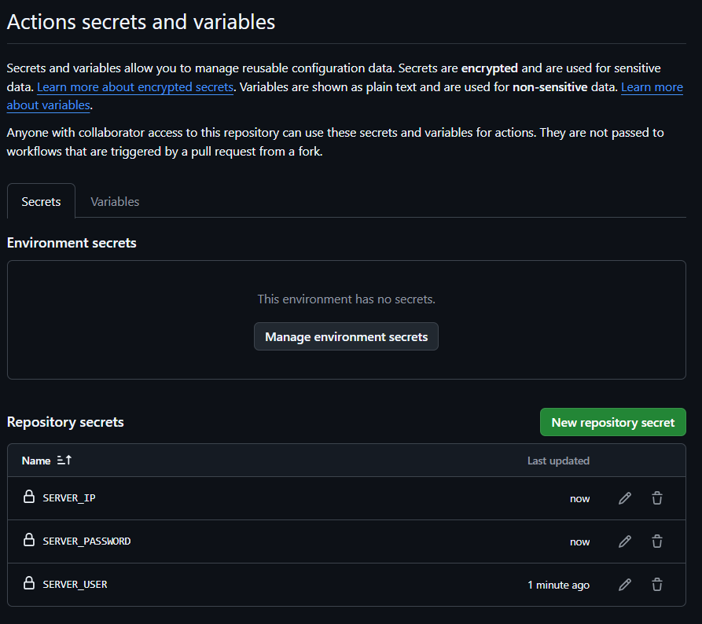

## Lab: Set up a CI/CD pipeline in GitHub Actions to build and deploy the container, including a simple test stage.

This labs walks you through the steps to set up a CI/CD pipeline using GitHub Actions to build and deploy a container, including a simple test stage.

---

## Prerequisites

1. **Ubuntu Server**:
   - SSH access to your server (username and password).
   - Docker already installed on the server.
   - Pre-built Docker image named `my-dotnet-container` already present on the server. Connect with VM using SSH and verify image exists before proceeding to next step.

2. **GitHub Repository**:
   - A GitHub repository where your application code resides.
   - Access to create and manage GitHub Actions workflows.

3. **Create a new repository**


---

## Step 1: Add Secrets to GitHub Repository

1. Go to your GitHub repository.
2. Navigate to **Settings > Secrets and variables > Actions**.
3. Add the following secrets:
   - `SERVER_USER`: SSH username for your server.
   - `SERVER_PASSWORD`: SSH password for your server.
   - `SERVER_IP`: IP address of your server.





---

## Step 2: Add a GitHub Actions Workflow

1. Create a GitHub Actions workflow file in your repository by clicking **creating a new file**:


2. Create a new file: `.github/workflows/ci-cd.yml` .


```yaml
name: CI/CD Pipeline

on:
  push:
    branches:
      - main
  pull_request:
    branches:
      - main

jobs:
  test:
    runs-on: ubuntu-latest

    steps:
    - name: Checkout code
      uses: actions/checkout@v3

    - name: Run tests
      run: |
        echo "Running tests..."
        # Add your test commands here

  deploy:
    runs-on: ubuntu-latest
    needs: test

    steps:
    - name: Deploy to server
      run: |
        sshpass -p "${{ secrets.SERVER_PASSWORD }}" ssh -o StrictHostKeyChecking=no ${{ secrets.SERVER_USER }}@${{ secrets.SERVER_IP }} \
        "docker stop my-dotnet-container || true && \
        docker rm my-dotnet-container || true && \
        docker run -d --name my-dotnet-container -p 5000:5000 my-dotnet-app && \
        sleep 10 && \
        curl http://localhost:5000"
```


---

## Step 3: Test Your Workflow

1. Commit the changes to your repository:

2. Go to the **Actions** tab in your GitHub repository and check the progress of your workflow.


---

## Step 4: Verify Deployment

1. Log in to your server to confirm the container is running:
   ```bash
   ssh username@server_ip
   docker ps --filter "name=my-dotnet-container"
   ```
2. Test your application by accessing your server’s IP address on port 5000 in a browser or using `curl`:
   ```bash
   curl http://server_ip:5000
   ```

  

#### Notes

- Ensure SSH and Docker ports are properly configured in your firewall.

---

You now have a fully functional CI/CD pipeline using GitHub Actions to deploy your pre-existing Docker containerized application `my-dotnet-container` to port 5000!

