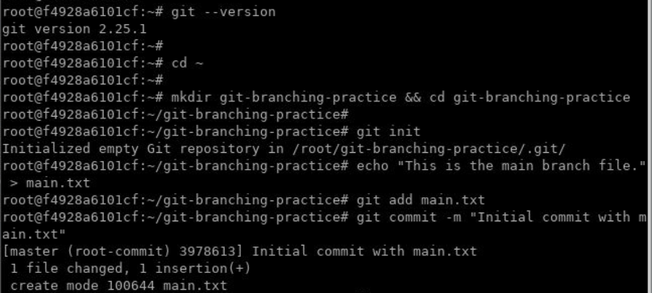
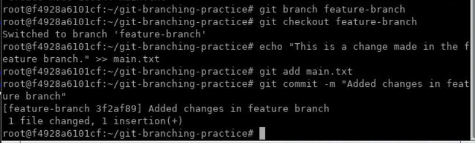
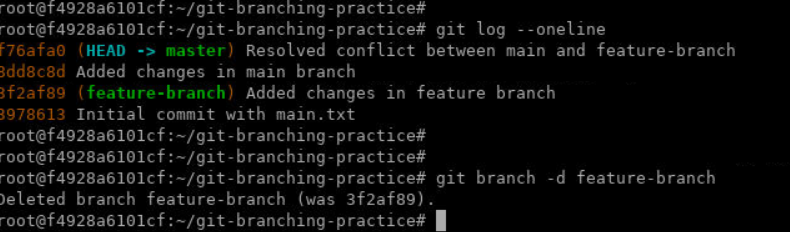
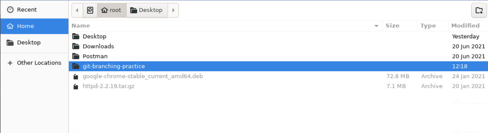
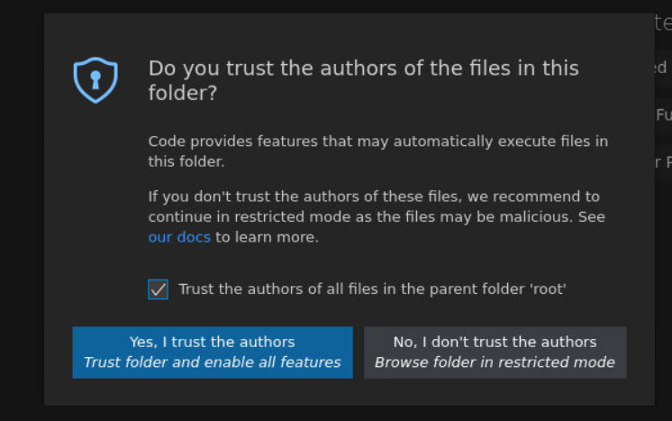
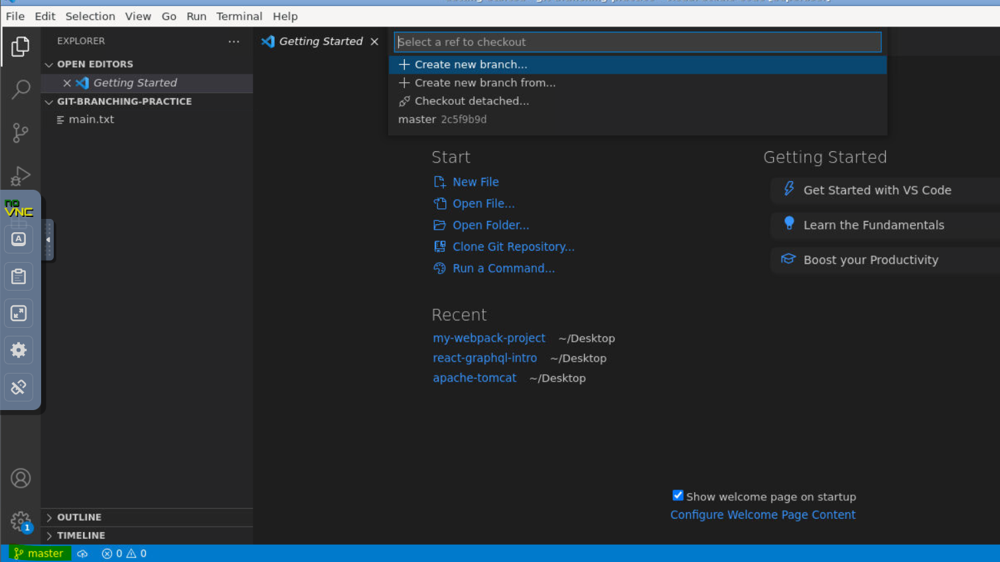
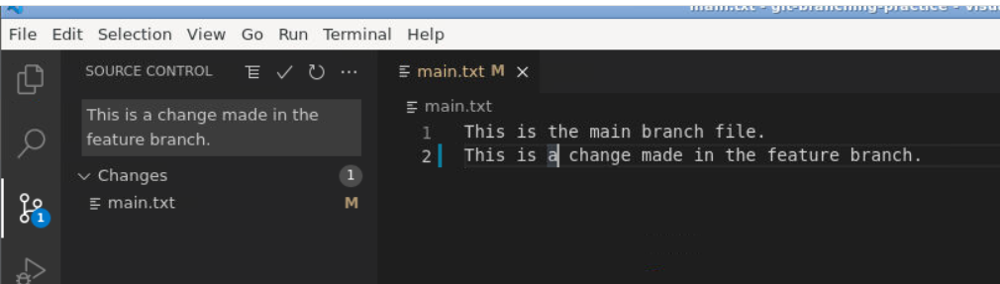
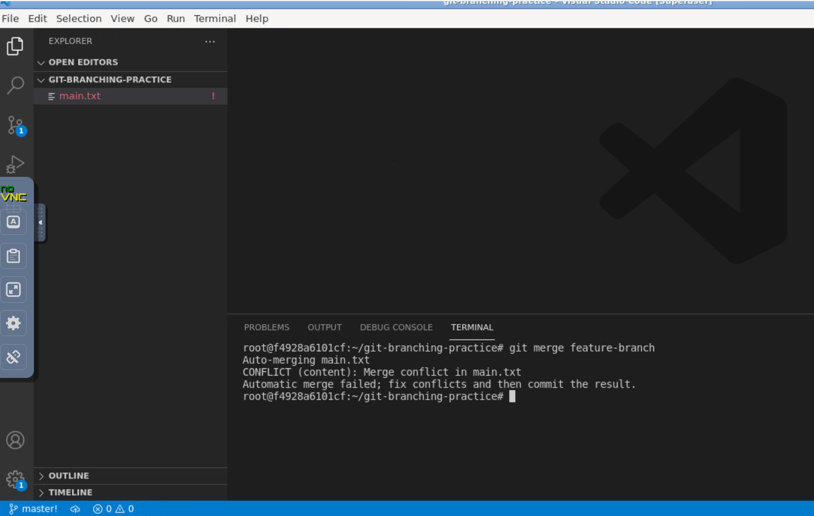
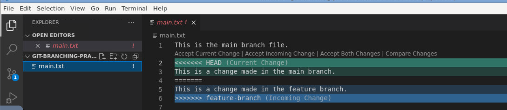
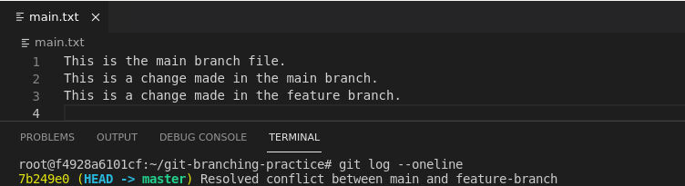

## Lab: Practice branching and resolving conflicts in a Git repository.

This lab will walk you through practicing branching and resolving conflicts in a Git repository using Ubuntu and Git CLI. Separate scenarios for using the CLI and VS Code are provided.

---

## Prerequisites

- Git installed on your Ubuntu system. Verify by running:

  ```bash
  git --version
  ```


- Basic understanding of Git commands.
- A text editor like `nano`, `vim`, or `code` (VS Code) for editing files.
- VS Code installed.

---

## Scenario 1: Using Git CLI

### Step 1: Setup a Git Repository

1. **Create a directory for the repository:**
   ```bash
   cd ~

   mkdir git-branching-practice && cd git-branching-practice
   ```

2. **Initialize a Git repository:**
   ```bash
   git init
   ```

3. **Create a file and commit it to the repository:**
   ```bash
   echo "This is the main branch file." > main.txt
   git add main.txt
   git commit -m "Initial commit with main.txt"
   ```



### Step 2: Create and Work on a Branch

1. **Create a new branch:**
   ```bash
   git branch feature-branch
   ```

2. **Switch to the new branch:**
   ```bash
   git checkout feature-branch
   ```

3. **Modify the file on the new branch:**
   ```bash
   echo "This is a change made in the feature branch." >> main.txt
   git add main.txt
   git commit -m "Added changes in feature branch"
   ```



### Step 3: Create a Conflict

1. **Switch back to the `master` branch:**
   ```bash
   git checkout master
   ```

2. **Make a conflicting change in the file on the `main` branch:**
   ```bash
   echo "This is a change made in the main branch." >> main.txt
   git add main.txt
   git commit -m "Added changes in main branch"
   ```

3. **Merge the `feature-branch` into `main` to create a conflict:**
   ```bash
   git merge feature-branch
   ```

   Git will notify you of a merge conflict in `main.txt`.

### Step 4: Resolve the Conflict

1. **View the conflicted file:**
   ```bash
   nano main.txt
   ```

   The file will include markers like this:
   ```
   <<<<<<< HEAD
   This is a change made in the main branch.
   =======
   This is a change made in the feature branch.
   >>>>>>> feature-branch
   ```

2. **Manually edit the file to resolve the conflict.** For example:
   ```
   This is the main branch file.
   This is a change made in the main branch and the feature branch.
   ```

3. **Stage the resolved file:**
   ```bash
   git add main.txt
   ```

4. **Complete the merge:**
   ```bash
   git commit -m "Resolved conflict between main and feature-branch"
   ```

### Step 5: Verify the Merge

1. **Check the commit history:**
   ```bash
   git log --oneline
   ```

2. **Ensure the `main` branch has the merged changes.**

3. **Delete the feature branch (optional):**
   ```bash
   git branch -d feature-branch
   ```



---

## Scenario 2: Using VS Code

### Step 1: Setup a Git Repository

1. **Create a directory for the repository:**
   ```bash
   cd ~

   rm -r git-branching-practice

   mkdir git-branching-practice && cd git-branching-practice
   ```

2. **Initialize a Git repository:**
   ```bash
   git init
   ```

3. **Create a file and commit it to the repository:**
   ```bash
   echo "This is the main branch file." > main.txt
   git add main.txt
   git commit -m "Initial commit with main.txt"
   ```

4. **Open the repository in VS Code**


### Step 2: Create and Work on a Branch

1. **Create a new branch:**
   - Open the Source Control tab in VS Code.
   - Click on the branch name in the bottom-left corner.
   - Select `Create new branch` and name it `feature-branch`.







2. **Switch to the new branch:**
   - Use the same branch menu in the bottom-left corner to switch to `feature-branch`.

3. **Modify the file on the new branch:**
   - Open `main.txt` in VS Code.
   - Add the line: `This is a change made in the feature branch.`
   - Save the file.
   - Use the Source Control tab to stage and commit the change with a message: `Added changes in feature branch`.



### Step 3: Create a Conflict

1. **Switch back to the `master` branch:**
   - Use the branch menu in the bottom-left corner to switch back to `master`.

2. **Make a conflicting change in the file on the `master` branch:**
   - Open `main.txt` in VS Code.
   - Add the line: `This is a change made in the main branch.`
   - Save the file.
   - Use the Source Control tab to stage and commit the change with a message: `Added changes in main branch`.

3. **Merge the `feature-branch` into `main` to create a conflict:**
   - Use the terminal in VS Code to run:
     ```bash
     git merge feature-branch
     ```
   - VS Code will highlight the conflict in `main.txt`.



### Step 4: Resolve the Conflict

1. **Open the conflicted file:**
   - Open `main.txt` in VS Code. The editor will highlight the conflicting sections.

2. **Use the VS Code conflict resolution tool:**
   - Click on `Accept Current Change`, `Accept Incoming Change`, or `Accept Both Changes` as appropriate.
   - Alternatively, manually edit the file in the editor.



3. **Stage and commit the resolved file:**
   - Use the Source Control tab to stage and commit the file with a message: `Resolved conflict between main and feature-branch`.

### Step 5: Verify the Merge

1. **Check the commit history:**
   ```bash
   git log --oneline
   ```
   

2. **Delete the feature branch:** (optional)
   - Open the terminal in VS Code and run:
     ```bash
     git branch -d feature-branch
     ```

---


## Summary

In this guide, you:
- Created a Git repository.
- Practiced branching.
- Created a conflict and resolved it using both CLI and VS Code.
- Cleaned up and verified the merge.
