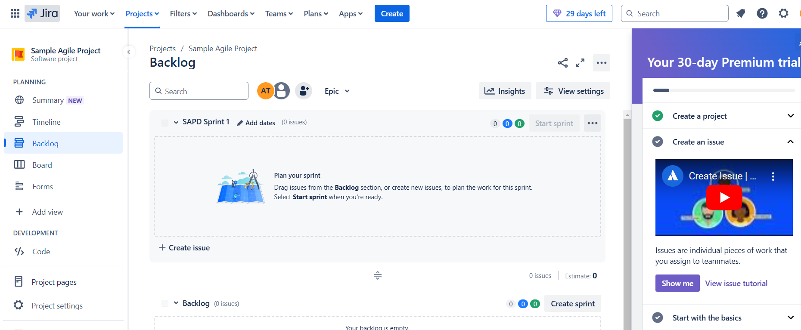

# Lab: Create an Agile project board and assign tasks for a sample sprint

This lab provides a detailed step-by-step walkthrough for signing up for Jira, creating an Agile project board, setting up a sprint, and assigning tasks. By following this, you will be able to organize and manage your project effectively using Agile methodologies.

---

## Step 1: Sign Up for Jira
1. Open your browser and go to the Jira Free plan signup page: [Jira Free Signup](https://www.atlassian.com/software/jira/free).
2. Click **Sign Up for Free**.
3. Provide the following details or **Signup** using other available options:
   - **Email Address:** Enter your email address.
   - **Full Name:** Enter your full name.
   - **Password:** Create a secure password.

4. Click **Agree and Sign Up**.
5. Check your email for a verification link and click on it to verify your account (if required).
6. Once verified, Jira will redirect you to your new account dashboard.

**Note:** Enter different prefix for your site:

Select **Software Development** or other releasvant option:

---

## Step 2: Create a New Project
1. On the Jira dashboard, locate the **Projects** menu in the top navigation bar.
2. Click **Create Project**.
3. A project type selection page will appear:
   - Choose **Scrum** (or **Agility** if this option is available).
4. Fill in the project details:
   - **Project Name:** Sample Agile Project
   - **Project Key:** SAPD (this will be used for issue keys, e.g., SAPD-1).
   - **Access:** Open.
5. Click **Create** to generate the project.
6. Jira will automatically redirect you to the newly created project dashboard.

Choose a project type -> **Select a team-managed project**

---

## Step 3: Configure the Board
1. Once in the project dashboard, look for the **Boards** option in the left-hand menu.
2. **Note:** Board is already created but if a board is not automatically created, follow these steps:
   - Click **Create Board**.
   - Select **Scrum Board**.
   - Choose the option to create the board from an existing project.
   - Link it to your **Sample Agile Project**.
3. Customize the board to suit your workflow:
   - Go to **Board Settings** (accessible from the top-right corner).
   - In the **Columns** section, add or modify columns to represent your workflow stages (e.g., To Do, In Progress, Done).
   - Map issue statuses to the appropriate columns.

---

## Step 4: Create a Sprint
1. Navigate to the **Backlog** view in your project by clicking **Backlog** in the left-hand menu.

2. Click **Create Sprint** to add a new sprint.
3. A new sprint section will appear in the backlog.
4. Rename the sprint by clicking the icon next to sprint name and entering a meaningful name, such as **Sample Sprint 1**.

---

## Step 5: Add Tasks to the Backlog and Sprint
1. In the backlog view, click the **Create Issue** button to add tasks.

2. Provide the following details for each task:
   - **Summary:** A short description of the task (e.g., "Design homepage layout").
   - **Issue Type:** Choose the type of task (e.g., Task, Bug, Story).
   - **Story point estimate:** Add different estimates for each task/story
   - **Description:** Add detailed instructions or context for the task.
3. Repeat the process to create multiple tasks.

4. Drag and drop tasks from the backlog into the sprint section to include them in the sprint.

Now, the story/task should show under sprint name.

---

## Step 6: Start the Sprint
1. Once all tasks have been added and assigned, click **Start Sprint** in the sprint section of the backlog.
2. A dialog will appear to configure sprint details:
   - **Sprint Name:** Confirm or modify the name (e.g., Sample Sprint 1).
   - **Sprint Goal:** Optionally add a goal (e.g., "Complete UI design for the homepage").
   - **Duration:** Set the duration of the sprint (e.g., 2 weeks).
   - **Start Date and End Date:** Specify the start and end dates.
3. Click **Start** to begin the sprint.

---

## Step 7: Assign Tasks to Team Members
1. Click on a task to open its issue details view.
2. Locate the **Assignee** field in the details panel.
3. Click **Assignee** and select a team member from the dropdown menu (or assign it to yourself if no team members are added).
4. Repeat this process for all tasks in the sprint.

---

## Step 8: Populate Data for Charts

Enable and display Reports icon on the left side menu using following steps:

Charts such as the **Cumulative flow diagram**, **Burndown Chart** and **Velocity Chart** require task activity during the sprint. To populate meaningful data for these charts during a lab session, follow these steps:

1. **Create Multiple Tasks:**
   - Create at least 6-8 tasks of varying priorities and complexities (e.g., "Setup login page UI," "Fix homepage alignment bug," "Implement user authentication").

2. **Assign and Update Task Status:**
   - Assign tasks to different yourself since we don't have other users.
   - Simulate task progress by updating task statuses from **To Do** to **In Progress** and then to **Done**.
   - Make sure to move tasks across columns frequently to show progress.

3. **Generate Reports:**
   - Go to the **Reports** section and select charts such as the **Burndown Chart** and **Sprint Report**.
   - Ensure task activity is reflected in the charts by creating, updating, and completing tasks during the session.

---

## Step 9: Track Progress During the Sprint
1. Use the **Active Sprint** board to monitor task progress:
   - Drag and drop tasks across columns as they move through stages (e.g., from To Do to In Progress).
   - Update task statuses directly from the board.

---

## Step 10: Complete the Sprint
1. At the end of the sprint, click **Complete Sprint** in the sprint view.
2. Review any incomplete tasks:
   - Choose to move them to the next sprint or return them to the backlog.
3. Click **Complete** to finalize the sprint.

---

### Conclusion
Congratulations! You have successfully signed up for Jira, created an Agile project board, configured it, added tasks, and managed a sprint. By repeating this process, you can effectively manage your projects and improve team productivity.
