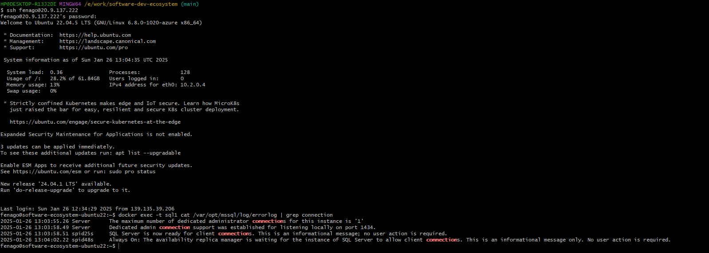
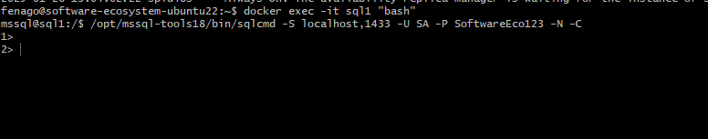
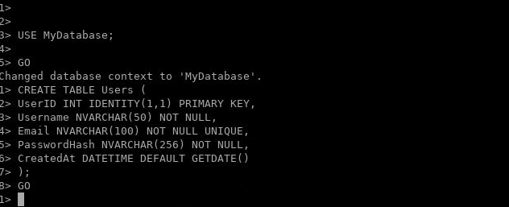
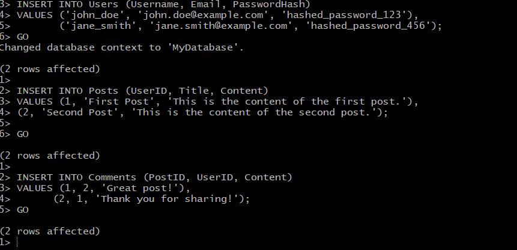
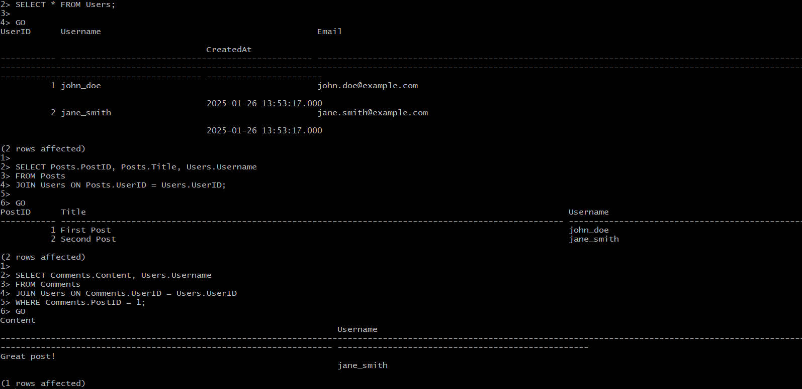

# Lab: Design and implement a basic SQL schema using SQL Server, with tables and relationships

This guide will walk you through the process of connecting to a SQL Server instance using SSH and designing a basic SQL schema with tables and relationships. Follow these steps carefully to complete the process.

---

## Step 1: Open Terminal and Connect via SSH

1. Open a terminal on your local machine.
2. Use the following command to connect to the remote machine via SSH:
   ```bash
   ssh username@remote_host
   ```
   Replace `username` with your SSH username and `remote_host` with the IP address or hostname of the remote machine.
3. If prompted, enter your SSH password to establish the connection.

4.  The server is ready for connections once the SQL Server error logs display the message: SQL Server is now ready for client connections. This is an informational message; no user action is required. You can review the SQL Server error log inside the container using the command:

```
docker exec -t sql1 cat /var/opt/mssql/log/errorlog | grep connection
```




---

## Step 2: Access the SQL Server Instance Using Docker

1. Once connected to the remote machine, access the SQL Server container using the following command:
   ```bash
   docker exec -it sql1 "bash"
   ```
   This will open a Bash shell inside the Docker container named `sql1`.

2. Use the following command to connect to the SQL Server instance:
   ```bash
   /opt/mssql-tools18/bin/sqlcmd -S localhost,1433 -U SA -P SoftwareEco123 -N -C
   ```
   - `-S localhost,1433`: Specifies the server and port.
   - `-U SA`: Specifies the username (System Administrator).
   - `-P SoftwareEco123`: Specifies the password.
   - `-N`: Ensures encryption of data.
   - `-C`: Trusts the server certificate.

3. Once connected, you will see the `1>` prompt, indicating that you are ready to execute SQL commands.




---

## Step 3: Design a Basic SQL Schema

### 3.1 Create a Database

**NOTE:** When using sqlcmd, avoid directly pasting entire queries. Instead, copy and paste line by line or manually type the query into the command line. Directly pasting large blocks of queries might result in unexpected behavior.


1. Execute the following command to create a new database:
   ```sql
   CREATE DATABASE MyDatabase;
   GO
   ```
2. Switch to the newly created database:
   ```sql
   USE MyDatabase;
   GO
   ```

### 3.2 Create Tables

#### Table: `Users`
This table will store user information.
```sql
CREATE TABLE Users (
    UserID INT IDENTITY(1,1) PRIMARY KEY,
    Username NVARCHAR(50) NOT NULL,
    Email NVARCHAR(100) NOT NULL UNIQUE,
    PasswordHash NVARCHAR(256) NOT NULL,
    CreatedAt DATETIME DEFAULT GETDATE()
);
GO
```




#### Table: `Posts`
This table will store posts created by users.
```sql
CREATE TABLE Posts (
    PostID INT IDENTITY(1,1) PRIMARY KEY,
    UserID INT NOT NULL,
    Title NVARCHAR(100) NOT NULL,
    Content NVARCHAR(MAX) NOT NULL,
    CreatedAt DATETIME DEFAULT GETDATE(),
    FOREIGN KEY (UserID) REFERENCES Users(UserID)
);
GO
```

#### Table: `Comments`
This table will store comments on posts.
```sql
CREATE TABLE Comments (
    CommentID INT IDENTITY(1,1) PRIMARY KEY,
    PostID INT NOT NULL,
    UserID INT NOT NULL,
    Content NVARCHAR(MAX) NOT NULL,
    CreatedAt DATETIME DEFAULT GETDATE(),
    FOREIGN KEY (PostID) REFERENCES Posts(PostID),
    FOREIGN KEY (UserID) REFERENCES Users(UserID)
);
GO
```

### 3.3 Verify the Schema

1. Use the following command to list all tables:
   ```sql
   SELECT TABLE_NAME  FROM INFORMATION_SCHEMA.TABLES WHERE TABLE_TYPE = 'BASE TABLE';
   GO
   ```
2. Use the following command to inspect the structure of a specific table:
   ```sql
   EXEC sp_help 'TableName';
   GO
   ```
   Replace `TableName` with the name of the table you want to inspect (e.g., `Users`).

---

### Create an ASCII Representation of Relationships

Based on the relationships, here is ASCII-style diagram:

```
Users
  ├── UserID (Primary Key)
  └── Posts
        ├── PostID (Primary Key)
        ├── UserID (Foreign Key → Users.UserID)
        └── Comments
              ├── CommentID (Primary Key)
              ├── PostID (Foreign Key → Posts.PostID)
              └── UserID (Foreign Key → Users.UserID)
```


---

## Step 5: Test the Schema

### 5.1 Insert Sample Data

#### Insert Users
```sql
INSERT INTO Users (Username, Email, PasswordHash)
VALUES ('john_doe', 'john.doe@example.com', 'hashed_password_123'),
       ('jane_smith', 'jane.smith@example.com', 'hashed_password_456');
GO
```

#### Insert Posts
```sql
INSERT INTO Posts (UserID, Title, Content)
VALUES (1, 'First Post', 'This is the content of the first post.'),
       (2, 'Second Post', 'This is the content of the second post.');
GO
```

#### Insert Comments
```sql
INSERT INTO Comments (PostID, UserID, Content)
VALUES (1, 2, 'Great post!'),
       (2, 1, 'Thank you for sharing!');
GO
```



### 5.2 Query Data

1. Retrieve all users:
   ```sql
   SELECT * FROM Users;
   GO
   ```
2. Retrieve all posts with user information:
   ```sql
   SELECT Posts.PostID, Posts.Title, Users.Username
   FROM Posts
   JOIN Users ON Posts.UserID = Users.UserID;
   GO
   ```
3. Retrieve all comments for a specific post:
   ```sql
   SELECT Comments.Content, Users.Username
   FROM Comments
   JOIN Users ON Comments.UserID = Users.UserID
   WHERE Comments.PostID = 1;
   GO
   ```



---

## Step 6: Exit the SQL Server and SSH Session

1. To exit the `sqlcmd` tool, type:
   ```sql
   EXIT
   ```
2. To exit the Docker container, type:
   ```bash
   exit
   ```
3. To disconnect from the SSH session, type:
   ```bash
   exit
   ```

---

## Conclusion

You have successfully connected to a SQL Server instance, designed a basic SQL schema, displayed relationships using CLI, and tested it with sample data. Use this foundation to build more complex schemas and applications.

---

