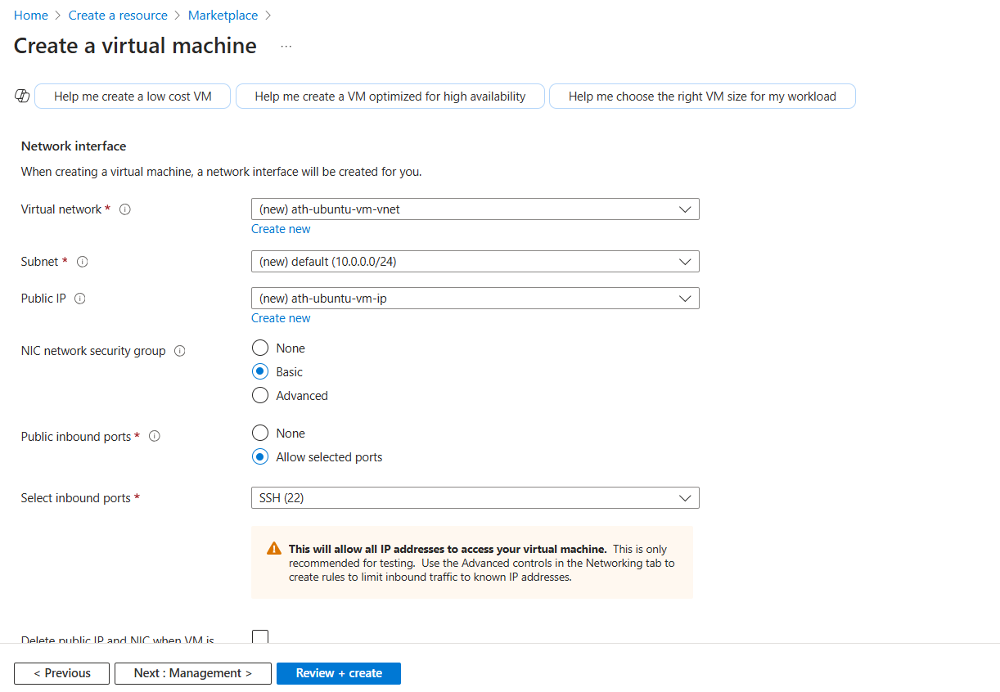

## Lab: Set up a secure server configuration, including basic firewall rules

In this lab, you will learn how to set up a secure server configuration on Microsoft Azure. You will create a virtual machine, apply a basic firewall configuration, and verify that your rules are working correctly.

---

## Prerequisites
1. **Azure Portal Access**: You will use the [Azure Portal](https://portal.azure.com/) to create and configure resources.
2. **Naming Convention**: All students share the same Azure environment, so each student must include their name as a prefix in resource names. Example: `YOUR_NAME-ubuntu-server`.
3. **Basic Networking Knowledge**: Familiarity with concepts like ports and firewall is recommended.

---

## Lab Objectives
- Create an Azure Virtual Machine (VM)
- Configure the VM’s network security group (NSG) for basic firewall rules
- Install and enable a firewall on the server
- Install and test Nginx
- Verify the firewall configuration and ensure secure access

---

### Section 1: Create a Virtual Machine

1. **Sign in to Azure Portal**
   - Open your web browser and go to the [Azure Portal](https://portal.azure.com/).
   - Enter your credentials to log in.

2. **Create a Resource**
   - On the Azure Portal homepage, click **Create a resource**.
   - In the **Search the Marketplace** field, type **Ubuntu Server** (or your preferred Linux distribution).
   - Select **Ubuntu Server** from the search results.
   - Click **Create**.


3. **Configure Basic Settings**
   - **Resource Group**: Select an existing resource group : `software-ecosystem-student-tmp`.
   - **Virtual Machine Name**: Use your name as the prefix. For example, `YOUR_NAME-ubuntu-vm`.
   - **Region**: `(US) WEST US 2`.
   - **Image**: Verify it's set to **Ubuntu Server**.
   - **Size**: Please make sure to select `B1s`.


**IMPORTANT**: If `B1s` size is not available, then you can select `Standard_D2s_v3` or any other available size.

4. **Administrator Account**
   - **Authentication type**: Select & enter **Password**.
   - **Username**:  `fenago`
   - **Password**: Make sure to remember the password you enter or use same password as Azure account.


5. **Inbound Port Rules**
   - To keep this lab secure, do not allow all ports publicly. However, for the sake of this exercise, you may allow **SSH (port 22)** so you can connect.
   - Any other ports you need should be locked down until you configure your firewall properly.


6. **Disks & Networking**
   - **Disks**: Use the OS disk type `Standard HDD`.
   - **Networking**: A default Virtual Network and Subnet should be created. Keep the default settings.
   - **Public IP**: Make sure a Public IP is assigned if you need to SSH from the internet.
   - **NIC Network Security Group**: Select **Basic** and allow **SSH**.



7. **Management, Advanced, and Tags**
   - Accept defaults

8. **Review + Create**
   - Review all settings on the **Review + create** tab.
   - If everything is correct, click **Create**.


9. **Wait for Deployment**
   - The VM deployment can take a few minutes. Once done, proceed to the next section.


---

### Section 2: Connect to the VM

1. **Locate Public IP**
   - In the Azure Portal, navigate to the new VM’s **Overview** page.
   - Copy the **Public IP address**.


2. **SSH into the VM** (assuming you allowed SSH in your inbound rules):
   ```bash
   ssh fenago@<public-ip>
   ```
   - Replace `<public-ip>` with the one from the portal.

3. **Confirm Connection**
   - Once connected, you should see a terminal prompt like: `fenago@YOUR_NAME-ubuntu-vm:~$`


---

### Section 3: Familiarize Yourself with VM Settings

Before configuring firewalls, it’s a good practice to check basic server health and settings:

1. **Check System Information**
   ```bash
   lsb_release -a
   uname -r
   ```
   - These commands confirm your Ubuntu version and kernel.
2. **Free Disk Space and Memory**
   ```bash
   df -h
   free -m
   ```
   - Ensure you have sufficient storage and RAM for any additional software.

---

### Section 4: Install and Configure UFW on Ubuntu

Now that you’re connected to the VM, you can install and configure the Uncomplicated Firewall (UFW), which is a simple yet effective way to manage firewall rules on Ubuntu.

1. **Update Package Lists**
   ```bash
   sudo apt-get update
   ```
2. **Install UFW** (it may already be installed on some Ubuntu images):
   ```bash
   sudo apt-get install -y ufw
   ```
3. **Check UFW Status** (by default, it may be inactive):
   ```bash
   sudo ufw status
   ```

   

4. **Set Default Policies** (it’s a good security practice to deny all incoming and allow all outgoing traffic by default):
   ```bash
   sudo ufw default deny incoming
   sudo ufw default allow outgoing
   ```
5. **Allow Necessary Inbound Connections**
   - **SSH (port 22)**:
     ```bash
     sudo ufw allow 22
     ```
   - **HTTP (port 80)**, To run a web server:
     ```bash
     sudo ufw allow 80
     ```
   - **HTTPS (port 443)**, if you plan to run a secure web server:
     ```bash
     sudo ufw allow 443
     ```
6. **Enable UFW**:
   ```bash
   sudo ufw enable
   ```
   - When asked if you want to proceed, type `y` and press Enter.

7. **Verify UFW Status**:
   ```bash
   sudo ufw status verbose
   ```
   - You should see rules for 22, 80, and 443 (if you allowed them).

   

---

### Section 5: Configure Azure Network Security Group (NSG) Rules

In addition to the VM’s internal firewall (UFW), Azure enforces inbound and outbound rules through a Network Security Group (NSG). Let’s ensure our Azure NSG rules align with what we configured on the VM.

1. **Locate the Network Interface**
   - In the Azure Portal, go to **Virtual machines** and select your VM (for example, `YOUR_NAME-ubuntu-vm`).
   - On the left-hand side, under **Networking**, click **Network Settings**.
2. **View  an NSG**
   - You should see existing inbound port rules for your VM’s NSG.

   

3. **Add or Adjust Inbound Security Rules**
   - Click **Add inbound port rule**.
   - **Source**: `Any` (or restrict to specific IP address ranges as needed for better security).
   - **Source port ranges**: `*`.
   - **Destination**: `Any`.
   - **Service**: `HTTP`.
   - **Protocol**: `TCP`.
   - **Action**: `Allow`.
   - **Name**: Provide a descriptive name (e.g., `Allow-80-http`).
   - Click **Add** or **Save** to apply the new rule.

   

4. **Confirm Any Additional Ports**
   - If you opened any other port on your VM, ensure you add corresponding rules in your NSG.
5. **Review Default NSG Rules**
   - Review all the Default NSG rules

---

### Section 6: Install and Test Nginx

Nginx is a popular open-source web server. Let’s install it and verify whether it’s accessible based on our firewall settings.

1. **Install Nginx**
   ```bash
   sudo apt-get install -y nginx
   ```
   - This will also install any dependencies needed for Nginx.
2. **Check Nginx Status**
   ```bash
   systemctl status nginx
   ```
   - Make sure it shows `active (running)`.
3. **Verify Port 80 is Open**
   - If you followed the previous steps, you should have allowed port 80 in both UFW and your NSG.
   - Confirm that port 80 is allowed in UFW:
     ```bash
     sudo ufw status
     ```
     You should see `80/tcp ALLOW`.
   - Confirm that port 80 is allowed in Azure NSG as well (under **Networking** for your VM in the Azure Portal).
4. **Test Access from a Browser**
   - On your local machine, open a web browser and go to `http://<public-ip>`.
   - If everything is correctly set up, you should see the default Nginx welcome page.
   

5. **Test Blocking by Removing or Blocking Port 80**
   - If you remove port 80 from UFW or your NSG, retry loading `http://<public-ip>` in the browser. It should fail to connect.
   - This confirms your firewall rules are actively controlling access.
   

---

### Section 7: Stop VM
Make sure to to **Stop** the VM from the Azure Portal.


---

## Conclusion
By completing this lab, you have:
- Created a Linux-based virtual machine in Azure.
- Configured firewall settings using **UFW** on the server.
- Applied and verified Azure Network Security Group (NSG) rules.
- Installed and tested Nginx.
- Confirmed secure access by testing allowed ports and blocked ports.

With these steps, you have taken an essential step toward understanding and implementing a secure server configuration in the Azure cloud.

