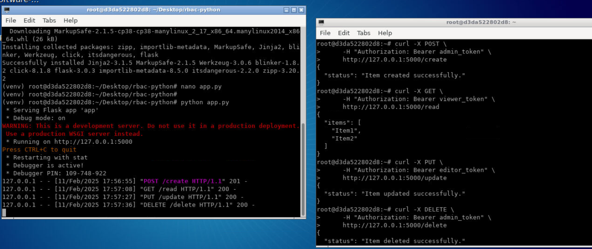
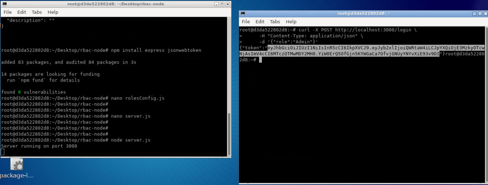
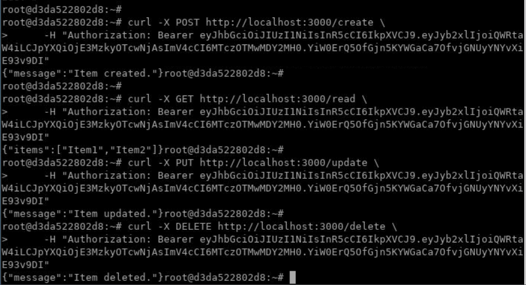

## Lab: Implement basic RBAC in a pre-built sample app to restrict access to specific user roles

In this lab, we will walk through setting up basic RBAC (Role-Based Access Control) for a sample application **step by step**, first in **Python** (Flask) and then in **Node.js** (Express). RBAC is a method of regulating access to application resources and actions based on user roles.


## 1. Prerequisites
- Basic knowledge of either **Python** (Flask/FastAPI) or **Node.js** (Express.js).
- A simple sample application where you can integrate RBAC.


## 2. Overview of RBAC
1. **Users** are assigned **roles**.
2. **Roles** determine the **permissions** (or privileges) that a user can perform.
3. **Permissions** specify which resources/actions are accessible.

RBAC ensures that users only have access to what they need for their role.

## 3. Sample Project Setup
1. **Python** sample project using Flask or FastAPI.
2. **Node.js** sample project using Express.
3. A simple authentication strategy (JWT tokens or session-based) already integrated.

In this lab, we will implement RBAC **first in Python** (Flask) and **then in Node.js** (Express). Follow each step carefully.

---

## 4. Defining Roles and Permissions
Before coding, define the roles and the resources/actions each role can perform:
- **Admin**: Can manage (create, read, update, delete) all data.
- **Editor**: Can create and edit content but not delete it.
- **Viewer**: Can only read content.

These definitions will be consistent across your code and database.

## 5. Storing User Roles
How you store roles depends on your existing setup:
1. **In the user database record**: A `role` field in your `users` table or collection.
2. **Separate roles collection**: A separate table or collection with user-role mappings.
3. **In-memory or config-based**: For simple prototypes, store roles/permissions in a JSON file or Python/JavaScript object.

---

## 6. Implementing RBAC in Python

### 6.1 Installing Dependencies

1. Create a new directory:
  ```bash
  cd ~/Desktop

  mkdir rbac-python && cd rbac-python
  ```

2. Create a virtual environment:
  ```bash
   python3 -m venv venv
  ```
3. Activate the virtual environment in Linux and install flask:
  ```bash
   source venv/bin/activate

   pip install flask
  ```


### 6.2 Configuring Roles and Permissions
Dictionary for roles and permissions:
```python
ROLES_PERMISSIONS = {
    "Admin": ["create", "read", "update", "delete"],
    "Editor": ["create", "read", "update"],
    "Viewer": ["read"]
}
```
This dictionary can be extended or stored in a database.

### 6.3 Middleware for Access Control
Create a middleware (or decorator) that:
1. Validates the user's authentication token (JWT or session).
2. Retrieves the user's role.
3. Checks whether the user’s role has the required permission for the requested action.

Flask Example:
```python
from functools import wraps
from flask import request, jsonify
from roles_config import ROLES_PERMISSIONS

def require_permission(permission):
    def decorator(f):
        @wraps(f)
        def wrapper(*args, **kwargs):
            # Extract user role from JWT or session
            user_role = get_user_role_from_token()
            # Check if user role has permission
            if permission not in ROLES_PERMISSIONS.get(user_role, []):
                return jsonify({"message": "Access Denied."}), 403
            return f(*args, **kwargs)
        return wrapper
    return decorator
```

### 6.4 Using Decorators or Wrapper Functions
Use the `@require_permission(permission)` decorator on specific routes to restrict access.

### 6.5 Example Routes
```python
@app.route("/create", methods=["POST"])
@require_permission("create")
def create_item():
    # code to create item
    return {"status": "created"}, 201

@app.route("/read", methods=["GET"])
@require_permission("read")
def read_items():
    # code to read items
    return {"items": []}, 200
```

### 6.6 Complete Example (Flask)
Below is a complete Flask application demonstrating RBAC with a simple in-memory token check:

**Note:** Create `app.py` file and paste following code:

```python
# app.py
from flask import Flask, jsonify, request
from functools import wraps

# Roles configuration
ROLES_PERMISSIONS = {
    "Admin": ["create", "read", "update", "delete"],
    "Editor": ["create", "read", "update"],
    "Viewer": ["read"]
}

# Mock token-to-role store (for testing only)
TOKEN_ROLE_MAP = {
    "admin_token": "Admin",
    "editor_token": "Editor",
    "viewer_token": "Viewer"
}

app = Flask(__name__)

# Helper function to extract role from a token
def get_user_role_from_token():
    # In real apps, parse and verify a JWT or session.
    # Here, we just read a mock token from the request header.
    token = request.headers.get("Authorization", "").replace("Bearer ", "")
    return TOKEN_ROLE_MAP.get(token, None)

# Decorator for requiring a permission
def require_permission(permission):
    def decorator(f):
        @wraps(f)
        def wrapper(*args, **kwargs):
            user_role = get_user_role_from_token()
            if not user_role:
                return jsonify({"message": "No valid token found."}), 401

            if permission not in ROLES_PERMISSIONS.get(user_role, []):
                return jsonify({"message": "Access Denied."}), 403
            return f(*args, **kwargs)
        return wrapper
    return decorator

@app.route("/create", methods=["POST"])
@require_permission("create")
def create_item():
    return jsonify({"status": "Item created successfully."}), 201

@app.route("/read", methods=["GET"])
@require_permission("read")
def read_items():
    return jsonify({"items": ["Item1", "Item2"]}), 200

@app.route("/update", methods=["PUT"])
@require_permission("update")
def update_item():
    return jsonify({"status": "Item updated successfully."}), 200

@app.route("/delete", methods=["DELETE"])
@require_permission("delete")
def delete_item():
    return jsonify({"status": "Item deleted successfully."}), 200

if __name__ == "__main__":
    app.run(debug=True)
```


### **Run Python (Flask) Step-by-Step**

1. **Run program**:
    ```bash
    python app.py
    ```
2. **Send requests** using cURL:
    ```bash
    # Create an item (Admin or Editor token required for 'create' permission)
    curl -X POST \
         -H "Authorization: Bearer admin_token" \
         http://127.0.0.1:5000/create

    # Read items (any role with 'read' permission)
    curl -X GET \
         -H "Authorization: Bearer viewer_token" \
         http://127.0.0.1:5000/read

    # Update item (Admin or Editor token required for 'update')
    curl -X PUT \
         -H "Authorization: Bearer editor_token" \
         http://127.0.0.1:5000/update

    # Delete item (Admin token required for 'delete')
    curl -X DELETE \
         -H "Authorization: Bearer admin_token" \
         http://127.0.0.1:5000/delete
    ```
3. Verify that each endpoint responds correctly based on the token provided.



**Note:** Make sure to exit python flask server before proceeding to next steps.


---

## 7. Implementing RBAC in Node.js

### 7.1 Installing Dependencies
```bash
cd ~/Desktop

mkdir rbac-node && cd rbac-node

npm init -y

npm install express jsonwebtoken
```

### 7.2 Complete Example (Express)
Below is a complete Express application demonstrating RBAC with a simple JWT flow:

**Note:** Create `rolesConfig.js` file and paste following code:

```js
// rolesConfig.js
module.exports = {
  Admin: ["create", "read", "update", "delete"],
  Editor: ["create", "read", "update"],
  Viewer: ["read"]
};
```

**Note:** Create `server.js` file and paste following code:


```js
// server.js
const express = require("express");
const jwt = require("jsonwebtoken");
const app = express();

const rolesConfig = require("./rolesConfig");

app.use(express.json());

// A mock login route that issues tokens
app.post("/login", (req, res) => {
  // In a real app, you'd validate username/password from DB.
  // We'll just accept a role from the request body.
  const { role } = req.body;

  // If the role isn't recognized, deny.
  if (!rolesConfig[role]) {
    return res.status(400).json({ message: "Invalid role." });
  }

  // Sign a simple JWT with the role in payload
  const token = jwt.sign({ role }, "SECRET_KEY", { expiresIn: "1h" });
  return res.json({ token });
});

// Middleware to require a given permission
function requirePermission(permission) {
  return function (req, res, next) {
    try {
      // Extract token from headers
      const authHeader = req.headers.authorization;
      if (!authHeader) {
        return res.status(401).json({ message: "No authorization header." });
      }
      const token = authHeader.split(" ")[1];
      const decodedToken = jwt.verify(token, "SECRET_KEY");
      const userRole = decodedToken.role;

      // Check if user role has required permission
      if (!rolesConfig[userRole] || !rolesConfig[userRole].includes(permission)) {
        return res.status(403).json({ message: "Access Denied." });
      }

      // Attach user data to request if needed
      req.user = decodedToken;
      next();
    } catch (error) {
      return res.status(401).json({ message: "Unauthorized." });
    }
  };
}

// Protected routes
app.post("/create", requirePermission("create"), (req, res) => {
  res.status(201).json({ message: "Item created." });
});

app.get("/read", requirePermission("read"), (req, res) => {
  res.status(200).json({ items: ["Item1", "Item2"] });
});

app.put("/update", requirePermission("update"), (req, res) => {
  res.status(200).json({ message: "Item updated." });
});

app.delete("/delete", requirePermission("delete"), (req, res) => {
  res.status(200).json({ message: "Item deleted." });
});

app.listen(3000, () => {
  console.log("Server running on port 3000");
});
```

---

## 8. How to Call and Test the APIs

### **Node.js (Express) Step-by-Step**
1. **Install dependencies and run**:
    ```bash
    node server.js
    ```
2. **Obtain a token** by calling the `/login` endpoint with a chosen role:
    ```bash
    curl -X POST http://localhost:3000/login \
         -H "Content-Type: application/json" \
         -d '{"role":"Admin"}'

    # Response example:
    # {
    #   "token": "<JWT_TOKEN_HERE>"
    # }
    ```

    

3. **Use the token** in subsequent requests:
    ```bash
    # Create (requires "create" permission)
    curl -X POST http://localhost:3000/create \
         -H "Authorization: Bearer <JWT_TOKEN_HERE>"

    # Read
    curl -X GET http://localhost:3000/read \
         -H "Authorization: Bearer <JWT_TOKEN_HERE>"

    # Update
    curl -X PUT http://localhost:3000/update \
         -H "Authorization: Bearer <JWT_TOKEN_HERE>"

    # Delete
    curl -X DELETE http://localhost:3000/delete \
         -H "Authorization: Bearer <JWT_TOKEN_HERE>"
    ```

    

4. Verify that each endpoint responds correctly based on the token provided. Try different roles (`Admin`, `Editor`, `Viewer`) to confirm that the permissions work as expected.

**Note:** Make sure to exit node server before proceeding to next lab.


#### Summary
In this lab, you learned how to set up a basic RBAC system in a pre-built **Python** and **Node.js** application:
1. Defined user roles and permissions.
2. Implemented middleware or decorators to enforce permissions.
3. Used route-level protection with the assigned user role.
4. Tested the endpoints by calling them with different tokens/roles.


